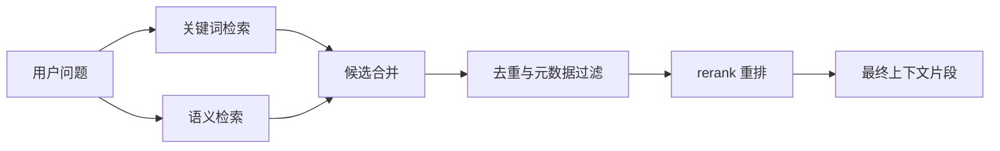

# 6. 检索基础：关键词、语义、混合检索与重排

> 模块：检索技术进阶  
> 建议学习时间：60 分钟

资料已经入库，下一步就是把问题和资料连起来。检索不是“搜一下”这么简单：有些问题靠关键词更准，有些问题靠语义更稳，还有些问题需要先召回一批候选，再用重排挑出最适合放进上下文的片段。

## 本章目标
- 能区分稀疏检索和密集检索。
- 能解释为什么企业 RAG 常用混合检索。
- 能理解 top_k 和 rerank 的作用。
- 能设计一条基础检索链路。

## 本章图解


## 核心知识点
### 1. 关键词检索擅长精确，语义检索擅长变体

稀疏检索通常依赖关键词或倒排索引，适合错误码、订单号、接口名、字段名。密集检索依赖 embedding，适合自然语言表达变化。

用户问“退款多久到账”时，语义检索能匹配“退款到账时效”；用户问“ERR_LOGIN_403”时，关键词检索通常更可靠，因为错误码不能被语义猜测。

基础做法是两路召回：关键词拿精确命中，向量拿语义相似，再合并去重。不同业务可以调整两路权重。

**放到真实场景里：**代码库助手里，组件名、方法名、错误码要靠关键词；“如何禁用按钮”这种自然语言问题更适合向量。

**容易踩的坑：**不要因为向量检索听起来更先进就放弃关键词。企业知识里有大量专有名词和编号。

### 2. 混合检索是为了降低单一路线的盲区

混合检索把关键词和语义检索结合起来，让系统既能抓住精确词，又能理解不同问法。

单靠关键词会漏掉同义表达，单靠向量会误伤专有名词。混合检索的目标不是复杂，而是让召回更稳。

可以先分别取两路 top_k，再合并、去重、按分数归一化或规则加权，最后交给重排模型或规则排序。

**放到真实场景里：**测试用例生成里，“验证码错误不计入密码错误次数”可能同时需要关键词“验证码”和语义“错误次数统计规则”。

**容易踩的坑：**合并候选不是简单拼列表。重复片段、旧版本、权限不符都要先处理。

### 3. 重排让候选结果从“可能相关”变成“更该使用”

rerank 是对初次召回的候选片段做二次排序。初次检索常常追求多找一点，重排则更关注当前问题到底需要哪几段。

向量检索的 top 结果不一定最适合生成。重排模型可以同时看问题和候选文本，判断哪段更直接回答问题。

常见链路是先召回 20-50 个候选，再重排取前 5-8 个进入上下文。这样既避免漏召回，也控制最终上下文噪声。

**放到真实场景里：**用户问“登录失败多久会锁定”，候选里可能有登录页说明、密码规则、账号冻结规则。重排应该把直接讲锁定条件的片段排前面。

**容易踩的坑：**top_k 开很大不等于更好。太多候选会增加成本，也可能让重排和上下文组装压力变大。

## 一个更稳的企业检索链路长什么样

企业检索通常不是单步完成，而是先过滤可见范围，再做多路召回，然后去重、重排、截断。每一步都在减少错误资料进入上下文的概率。

| 步骤 | 它解决什么 | 常见检查 |
| --- | --- | --- |
| 权限/版本过滤 | 先排除不能用的资料 | 用户角色、业务域、版本 |
| 关键词召回 | 抓住错误码、字段名、专有名词 | BM25 或倒排索引 |
| 向量召回 | 理解自然语言变体 | embedding 相似度 |
| 候选去重 | 减少重复片段挤占上下文 | source + chunk_path |
| 重排 | 挑出最能回答当前问题的片段 | cross-encoder 或 LLM rerank |

### 先召回，再挑选，不要一步到位

初次召回可以稍微宽一点，给正确资料进入候选的机会；最终进入上下文要收紧，只留下最能支撑答案的片段。

### 检索链路也要有日志

记录每一路召回了什么、分数是多少、为什么被过滤或重排。没有日志，检索优化会变成猜谜。

#### 混合检索 + 重排伪代码

```js
async function retrieve(question, user) {
  const filter = buildPermissionFilter(user);
  const keywordHits = await keyword.search(question, { filter, topK: 20 });
  const vectorHits = await vector.search(await embed(question), { filter, topK: 20 });
  const merged = dedupe([...keywordHits, ...vectorHits]);
  return reranker.rank(question, merged).then(items => items.slice(0, 8));
}
```

**Takeaway：**检索链路的目标不是返回最多资料，而是让正确、可用、足够支撑答案的资料排在前面。

## 常见误区
- 向量检索不能替代所有关键词检索。
- top_k 越大不等于越好，它会带来噪声和成本。
- rerank 不是魔法，候选里没有正确资料时它也救不了。
- 检索阶段就要做权限过滤。

## 检索这章，核心是别赌单一路线

关键词、向量、过滤、重排各自解决不同问题。企业 RAG 更像一个分层筛选系统：先保证资料可用，再扩大召回，最后精挑细选。

- 关键词适合精确项，向量适合同义问法。
- 混合检索降低盲区。
- 重排把候选从“像”排成“更能回答”。

下一章会继续往前看：用户的问题本身也需要处理。很多时候检索不准，不是资料不行，而是问题没有被构造成适合检索的形状。

## 快速自测
1. 错误码更适合优先用什么检索？
   - A. 关键词检索
   - B. 随机检索
   - C. 图片检索
   - 答案：关键词检索

2. rerank 的作用是什么？
   - A. 二次排序
   - B. 删除权限
   - C. 训练模型
   - 答案：二次排序

3. 混合检索结合了什么？
   - A. 关键词和语义
   - B. 字体和颜色
   - C. 登录和注册
   - 答案：关键词和语义

4. top_k 太大可能带来什么？
   - A. 噪声增加
   - B. 事实变新
   - C. 权限消失
   - 答案：噪声增加

## 练一下

为“代码库助手”设计一条检索链路：哪些问题走关键词，哪些问题走向量，怎样合并候选，什么时候重排，记录哪些日志。

## 主要参考
- [Datawhale RAG 混合检索](https://github.com/datawhalechina/all-in-rag/blob/main/docs/chapter4/11_hybrid_search.md)
- [Datawhale RAG 检索进阶](https://github.com/datawhalechina/all-in-rag/blob/main/docs/chapter4/15_advanced_retrieval_techniques.md)
- [RAG 优化方案与实践](https://zhuanlan.zhihu.com/p/703182970)
