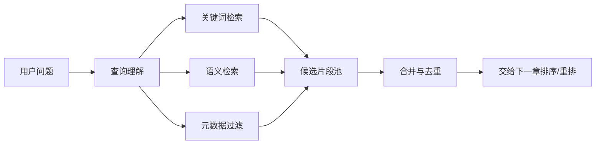

# 第 6 章：检索第一版：关键词、语义、混合检索和权限过滤

前面几章我们把资料、分块和向量都讲过了。到这里，很多人会自然冒出一个想法：既然已经有 embedding，是不是直接用向量搜索就够了？不太够。RAG 里的检索不是单纯“找相似”，而是尽量把真正能回答问题的材料找出来。第 6 章先不写项目代码，我们把检索这件事拆开看。

## 这一章先掌握 4 个判断

- 理解召回
- 区分关键词与语义检索
- 理解混合检索
- 看懂权限和元数据过滤

## 检索，不是“搜一下”这么简单

在普通搜索里，我们常常默认：输入关键词，返回结果。但 RAG 的检索更挑剔。它要找的不是“包含某个词的页面”，而是能被模型拿来回答问题的证据片段。



## 知识点一：关键词检索守住精确词

关键词检索的代表是 BM25、倒排索引、TF-IDF 这一类方法。它们适合错误码、产品型号、合同编号、接口字段、版本号。

## 知识点二：语义检索补上表达差异

语义检索适合“字面不同，但意思接近”的问题。它不是关键词检索的替代品，而是另一种视角。

## 知识点三：混合检索不是堆功能，而是补短板

#### 混合检索的最小思路，不是完整代码

```text
候选片段 = []

关键词结果 = 搜索包含关键术语的片段
语义结果 = 搜索语义最接近的片段

候选片段 += 关键词结果
候选片段 += 语义结果

候选片段 = 按权限、版本、业务域过滤
候选片段 = 合并重复片段

返回候选片段给排序阶段
```

## 知识点四：元数据过滤是边界，不是优化项

元数据过滤处理权限、版本、业务域、时间范围。一个片段可以非常相关，但用户没有权限；也可以语义相似，但版本过期。

## 练一下

不用写代码。拿出 5 个你熟悉的企业问题，给每个问题标注：更依赖关键词、语义、元数据，还是混合检索。标注完以后再问自己：如果它答错，最可能是漏召回，还是召回了没权限/过期资料？

## 快速自测

- 为什么不能只依赖向量检索？ 答案：精确词会丢。型号、错误码、版本号这类信息往往更适合关键词或元数据过滤。
- 混合检索主要混合什么能力？ 答案：精确与语义。它把关键词的精确匹配和向量的语义泛化放在一起使用。
- 权限过滤应该尽量放在哪个阶段？ 答案：候选进入前。用户没权限看的片段不该进入候选池，更不该交给模型。

## 本章参考资料

- [Datawhale All-in-RAG: 混合检索](https://github.com/datawhalechina/all-in-rag/blob/main/docs/chapter4/11_hybrid_search.md)：社区教程，用于 dense、sparse、hybrid 检索。
- [Datawhale All-in-RAG: 索引优化](https://github.com/datawhalechina/all-in-rag/blob/main/docs/chapter3/10_index_optimization.md)：社区教程，用于元数据、句子窗口和结构化索引。
- [RAG Best Practices](https://github.com/ali-bahrainian/RAG_best_practices)：社区项目，用于参数实验、chunk、top_k、query expansion 等实践意识。
