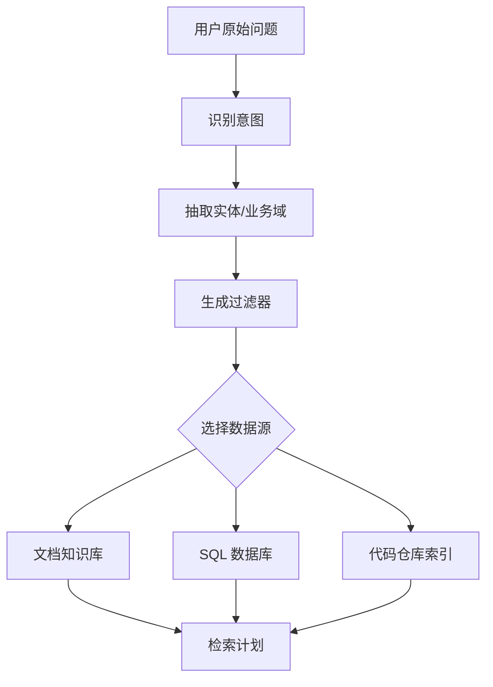

# 7. 查询构建：把用户的话翻译成系统能执行的检索计划

> 模块：检索技术进阶  
> 建议学习时间：60 分钟

用户不会按知识库结构提问。他可能说：“帮我生成登录异常测试用例，按我们现在的模板来。”这句话里混着业务域、任务类型、资料类型、输出格式。查询构建就是把一句自然语言拆成系统能执行的检索计划。

## 本章目标
- 能解释查询构建解决的问题。
- 能把自然语言问题拆成关键词、过滤器和检索意图。
- 能理解路由、多数据源和 Text2SQL 的适用边界。
- 能设计一个简单查询计划。

## 本章图解


## 核心知识点
### 1. 用户问题里常常藏着过滤条件

“登录模块”“2026Q1”“客服内部”“测试用例模板”这些词，不只是普通关键词，也可能是业务域、版本、权限和文档类型。

如果系统把所有词都当语义检索文本，会在全库里盲找。查询构建会把其中一部分提取成过滤器，先缩小范围，再检索。

常见字段包括 domain、version、doc_type、audience、permission、product、language。提取后生成结构化查询计划，例如 domain=login，doc_type in [prd,test_case]。

**放到真实场景里：**用户问“按最新客服政策回答会员退款”，系统应该识别 latest、客服政策、会员退款，而不是只拿整句话做向量。

**容易踩的坑：**过滤器太强也会漏召回。比如版本识别错了，正确资料会被提前排除，所以关键过滤条件要可回退。

### 2. 路由决定问题应该去哪类知识源

企业 RAG 往往不止一个知识库：文档、数据库、代码仓库、工单系统、指标平台都可能是知识源。

不同问题适合不同检索方式。问制度条款，走文档；问订单数量，走数据库；问组件用法，走代码仓库；问历史缺陷，走工单或测试平台。

可以先做意图分类：知识问答、数据查询、代码解释、用例生成、排障。再把问题路由到对应 retriever 或工具。

**放到真实场景里：**“上周退款订单有多少”不适合只查政策文档，它更像数据库问题；“退款规则是什么”才是文档 RAG。

**容易踩的坑：**不要把所有问题都塞给同一个向量库。数据源错了，再好的检索也找不到答案。

### 3. Text2SQL 适合结构化数据，不适合替代文档问答

Text2SQL 是把自然语言转成 SQL 查询，适合查表格数据、指标、订单、库存、日志聚合。

它解决的是结构化数据查询，不是让模型读制度文档。Text2SQL 需要表结构、字段含义、权限和安全限制，否则容易生成危险或错误 SQL。

一个安全流程会先选择允许访问的表，提供字段说明和样例，再生成 SQL，校验只读和权限，最后执行并解释结果。

**放到真实场景里：**用户问“过去 7 天退款订单按原因分布”，Text2SQL 合适；用户问“退款规则有哪些例外”，文档 RAG 合适。

**容易踩的坑：**不要让模型直接对生产库自由写 SQL。必须有白名单、只读限制、超时、行数限制和审计。

## 从一句话拆出一份检索计划

查询构建的产物不一定给用户看，但系统应该能记录它。比如用户说“基于 2026Q1 登录 PRD 和历史缺陷，生成后台登录异常测试用例”，这里至少包含任务、业务域、版本、数据源、文档类型和输出意图。

| 原始表达 | 结构化含义 | 检索影响 |
| --- | --- | --- |
| 生成测试用例 | task=test_case_generation | 需要 PRD、规则、历史用例模板 |
| 后台登录 | domain=login, product=admin | 过滤业务域和产品端 |
| 2026Q1 | version=2026Q1 | 优先最新版本 |
| 历史缺陷 | doc_type=bug | 召回缺陷经验物料 |
| 异常 | scenario=negative | 重点找边界和错误流程 |

### 查询计划要能解释，而不是黑箱

当检索结果不对时，先看查询计划：是否识别错业务域，是否漏了文档类型，是否过滤太窄。可解释的计划让调试快很多。

### 允许回退，别把用户问题一次判死

如果强过滤没有结果，可以降级到宽过滤；如果路由不确定，可以并行查两个数据源。企业问题常常不干净，系统也要留弹性。

#### 查询计划对象示例

```js
const queryPlan = {
  task: "test_case_generation",
  intent: "retrieve_requirements_and_defects",
  filters: {
    domain: "login",
    product: "admin",
    version: "2026Q1",
    docType: ["prd", "bug", "test_case_template"]
  },
  retrievers: ["document", "issue_tracker"]
};
```

#### 查询计划对象示例

```java
record QueryPlan(
  String task,
  Map<String, Object> filters,
  List<String> retrievers
) {}
```

**Takeaway：**查询构建把一句自然语言翻译成可执行、可解释、可回退的检索计划。

## 常见误区
- 查询构建不是把问题改写得更长，而是提取可执行条件。
- Text2SQL 不适合所有问题，它主要查结构化数据。
- 路由判断错了，检索会从源头跑偏。
- 过滤越多不一定越好，太窄会漏召回。

## 问题也需要被整理

前几章我们整理资料，这一章开始整理用户问题。好的查询构建能把自然语言里的业务域、版本、权限、任务类型翻译成检索计划，让系统少在错误资料里绕路。

- 从问题里抽取过滤条件。
- 按意图路由到文档、数据库、代码或工单。
- Text2SQL 只适合结构化数据查询，并且必须受控。

下一章继续处理用户问题，但会更进一步：当用户问得模糊、太短或需要多步推理时，系统要学会改写、拆解和多跳检索。

## 快速自测
1. 查询构建主要产出什么？
   - A. 检索计划
   - B. 页面皮肤
   - C. 登录按钮
   - 答案：检索计划

2. Text2SQL 适合查询什么？
   - A. 结构化数据
   - B. 任意图片
   - C. 模型参数
   - 答案：结构化数据

3. 路由的作用是什么？
   - A. 选择数据源
   - B. 隐藏答案
   - C. 压缩字体
   - 答案：选择数据源

4. 过滤器太强可能导致什么？
   - A. 漏召回
   - B. 权限变好
   - C. 成本归零
   - 答案：漏召回

## 练一下

写 5 个用户问题，并把每个问题拆成 task、filters、retrievers、fallback 四部分。至少包含一个文档问答、一个数据查询、一个代码库问题。

## 主要参考
- [Datawhale RAG 查询构建](https://github.com/datawhalechina/all-in-rag/blob/main/docs/chapter4/12_query_construction.md)
- [Datawhale RAG 文本到 SQL](https://github.com/datawhalechina/all-in-rag/blob/main/docs/chapter4/13_text2sql.md)
- [LangChain RAG 教程](https://docs.langchain.com/oss/python/langchain/rag)
