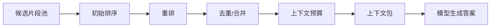

# 第 7 章：从找得到到排得对：重排、去重和上下文包

第 6 章讲的是“找得到”。但 RAG 真正让人头疼的地方，经常发生在找得到以后：候选片段有 20 个，模型上下文只能放 5 个；有些片段说的是规则，有些片段只是历史个案；还有两段资料看起来互相打架。第 7 章不急着写 rerank 接口，我们先把排序、重排、去重和上下文包这几个概念讲清楚。

## 这一章先看 4 个环节

- 理解排序分数
- 理解 rerank 的作用
- 控制上下文长度
- 识别证据冲突

## 候选片段多，不代表答案更稳

很多初学者第一次调 RAG，会把 top_k 越开越大。这个动作很自然，但方向经常不对。



## 知识点一：初始排序只是粗排

初始排序通常来自检索分数。相似，不等于可信；匹配，不等于能回答。

## 知识点二：rerank 是重新看一遍“问题和片段的关系”

rerank 通常发生在召回之后。它更像把问题和片段放在一起细看，但更慢、更贵，所以一般只处理小候选集。

## 知识点三：去重不是洁癖，是给有用信息腾位置

候选片段里如果有多段重复同一条规则，它们会挤掉另一条真正有用的信息。

## 知识点四：上下文包决定模型最后看到什么

#### 上下文包的组成，不是项目代码

```text
给模型的上下文包，通常不只是片段正文：

1. 用户原始问题
2. 经过筛选的候选片段
3. 每个片段的来源、标题、版本、权限
4. 回答规则：不足则拒答，引用必须对应片段
5. 输出格式：答案、引用、缺失信息
```

## 练一下

不用实现 rerank。找一个真实问答场景，手动列出 6 条候选资料，然后按“直接回答问题、补充背景、重复信息、过期/冲突、无关”分类。最后只选 3 条放进上下文包，并写一句为什么舍弃其他 3 条。

## 快速自测

- rerank 主要发生在什么时候？ 答案：召回之后。重排通常处理已经召回的一批候选片段，把更适合回答的问题排到前面。
- top_k 很大为什么可能变差？ 答案：噪声更多。候选太多会占用上下文，还可能带入冲突资料，让模型分心。
- 上下文包为什么要带来源信息？ 答案：方便引用。没有来源、版本和标题，模型即使答对，也很难让人核对证据。

## 本章参考资料

- [Datawhale All-in-RAG: 检索进阶](https://github.com/datawhalechina/all-in-rag/blob/main/docs/chapter4/15_advanced_retrieval_techniques.md)：社区教程，用于多路召回、重排和检索优化。
- [RAG Best Practices](https://github.com/ali-bahrainian/RAG_best_practices)：社区项目，用于参数实验、chunk、top_k、query expansion 等实践意识。
- [LangChain Docs: Build a RAG agent](https://docs.langchain.com/oss/python/langchain/rag)：用于对照 indexing、retrieval、generation 的工程拆分。
