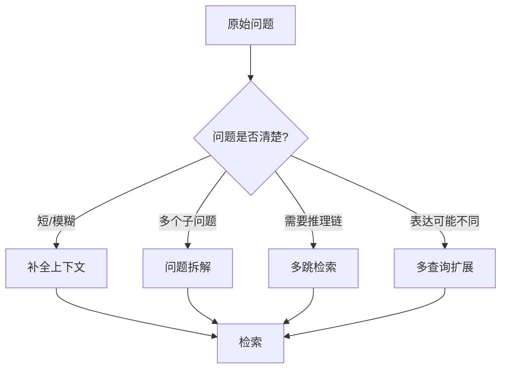

# 8. 查询重写与进阶检索：让系统会追问、会拆题、会多跳查资料

> 模块：检索技术进阶  
> 建议学习时间：60 分钟

不是每个用户问题都清楚。有人只问“这个怎么测”，有人把多个问题塞在一句话里，有人用口语说“它会不会锁住”。查询重写和进阶检索的作用，就是在检索前先把问题变得更可查，必要时分多步查。

## 本章目标
- 能解释查询重写的用途。
- 能区分扩写、拆解、HyDE、多查询和多跳检索。
- 能理解 agentic RAG 的基本思路。
- 能判断什么时候不该过度改写。

## 本章图解


## 核心知识点
### 1. 查询重写是为了更好检索，不是为了改写文案

查询重写会把用户原始问题改成更适合检索的表达。它可以补全省略、统一术语、拆分子问题，也可以生成多个等价问法。

用户说“这个怎么测”，如果上一轮聊的是登录锁定规则，系统应该把“这个”补成“登录密码错误锁定规则”。否则直接检索“这个怎么测”几乎没有意义。

常见方式包括：上下文补全、关键词扩展、同义改写、问题拆解、多查询并发、假设性答案生成。每种方式都要记录原问题和改写后问题。

**放到真实场景里：**测试同学问“边界条件还有哪些”，系统可以改写为“登录模块密码错误次数、验证码错误、账号锁定时长的边界条件”。

**容易踩的坑：**改写不能改变用户意图。把“登录失败”改成“支付失败”，检索再努力也错了。

### 2. 多查询适合表达不确定，问题拆解适合任务复杂

多查询是生成多个检索表达，覆盖不同说法；问题拆解是把一个复杂问题拆成多个子问题，分别查资料。

如果用户问法可能和资料写法不同，多查询有用；如果用户要求生成测试用例、覆盖异常和历史缺陷，就需要拆成规则、接口、缺陷、模板几个子问题。

多查询通常并行检索后合并去重；问题拆解则要保留子问题和最终任务的关系，避免各查各的后无法合成。

**放到真实场景里：**“退款多久到账”可以扩展为“退款时效、到账时间、退钱几天”；“生成登录测试用例”要拆成规则、字段、异常、历史缺陷、模板。

**容易踩的坑：**不要把所有问题都扩成一堆查询。查询越多，成本越高，噪声也越多。

### 3. 多跳检索适合答案需要沿着线索追下去

多跳检索不是一次找完，而是先找第一批资料，再基于中间结果继续检索。

有些问题需要跨文档连接。例如“这个历史缺陷对应的规则现在是否还有效”，系统要先找到缺陷，再找到关联规则和当前版本说明。

多跳流程一般是：检索初始线索，抽取实体或引用，生成下一跳查询，再检索补充资料，最后合成答案并列出证据链。

**放到真实场景里：**代码库助手回答“这个组件为什么不推荐继续用”，可能要先查组件说明，再查迁移指南，最后查历史 issue。

**容易踩的坑：**多跳检索容易引入错误链条。第一跳错了，后面会越走越偏，所以每跳都要保留证据和停止条件。

## 生成测试用例时，查询重写应该怎么做

“帮我生成登录异常测试用例”不是一个简单检索问题。系统需要找到规则、接口字段、异常流程、历史缺陷和用例格式。更好的做法是先拆任务，再分别检索。

| 子问题 | 检索资料 | 输出作用 |
| --- | --- | --- |
| 登录有哪些核心规则？ | PRD / 业务规则 | 决定正常路径和边界 |
| 有哪些异常提示？ | 异常流程 / 页面文案 | 决定负向用例 |
| 接口有哪些字段和错误码？ | 接口文档 | 决定参数组合 |
| 历史上出过什么问题？ | 缺陷记录 | 补充回归场景 |
| 用例格式是什么？ | 历史用例模板 | 保证结果可接收 |

### 重写后的问题要服务最终任务

不是把问题变得华丽，而是让每个子查询都能拿回一类必要证据。最后合成答案时，也要标明每类用例来自哪些资料。

### 拆题后更要防止资料打架

不同子查询可能召回不同版本资料。合成前要按版本、状态和权限统一，否则答案会把旧缺陷和新规则混在一起。

#### 任务拆解式检索

```js
const subQueries = [
  "登录模块业务规则 2026Q1",
  "登录异常流程 错误提示",
  "登录接口字段 错误码",
  "登录历史缺陷 回归场景",
  "测试用例模板 前置条件 步骤 预期结果"
];

const evidence = await Promise.all(subQueries.map(q => retrieve(q, user)));
```

**Takeaway：**进阶检索的关键不是“查得更多”，而是围绕任务有计划地查。

## 常见误区
- 查询重写不是随意扩写，不能改变用户意图。
- 多查询会增加噪声，需要合并去重和评测。
- 多跳检索适合复杂问题，不适合每个简单问答。
- Agentic RAG 也需要边界和停止条件。

## 让系统先想清楚怎么问

第八章把检索前的智能补上了：问题短，就补全；问题复杂，就拆解；表达可能不同，就多查询；需要沿线索查，就多跳。它们都服务同一个目标：让正确资料更有机会进入候选。

- 重写服务检索，不服务文采。
- 拆题适合复杂任务，多查询适合表达差异。
- 多跳检索要保留证据链和停止条件。

资料找到了，下一章要进入生成阶段：怎么把资料交给模型，既回答得像人话，又不乱编、不乱引。

## 快速自测
1. 查询重写不能改变什么？
   - A. 用户意图
   - B. 页面颜色
   - C. 文件大小
   - 答案：用户意图

2. 多查询主要覆盖什么？
   - A. 不同表达
   - B. 不同字体
   - C. 不同账号
   - 答案：不同表达

3. 多跳检索每一步都要保留什么？
   - A. 证据链
   - B. 动画
   - C. 随机数
   - 答案：证据链

4. 复杂用例生成更适合先做什么？
   - A. 任务拆解
   - B. 直接回答
   - C. 删除资料
   - 答案：任务拆解

## 练一下

把“帮我生成登录模块异常测试用例”拆成 5 个子查询，并为每个子查询写出需要检索的资料类型和最终会影响哪类用例。

## 主要参考
- [Datawhale RAG 查询重构与分发](https://github.com/datawhalechina/all-in-rag/blob/main/docs/chapter4/14_query_rewriting.md)
- [Datawhale RAG 检索进阶](https://github.com/datawhalechina/all-in-rag/blob/main/docs/chapter4/15_advanced_retrieval_techniques.md)
- [RAG 18 种常见算法对比](https://blog.csdn.net/l01011_/article/details/149039999)
