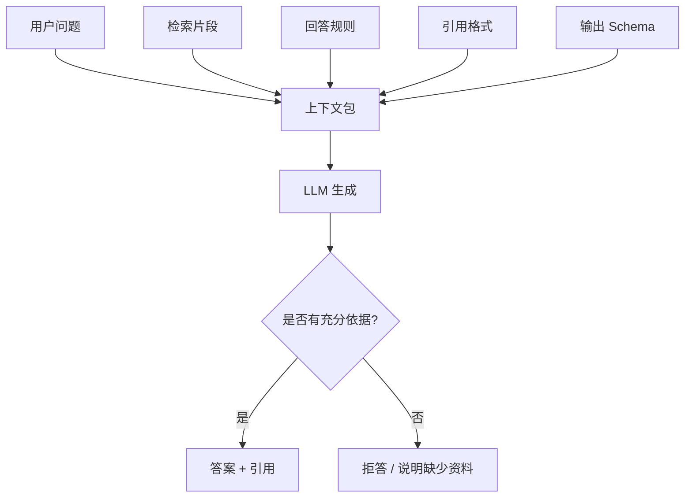

# 9. 生成阶段：上下文组装、引用、拒答与结构化输出

> 模块：生成集成与评估  
> 建议学习时间：60 分钟

检索到了资料，不代表答案自然就会好。生成阶段像把食材交给厨师：食材要新鲜，菜单要明确，禁忌也要写清楚。RAG 的生成不是让模型自由聊天，而是让模型在给定上下文、引用规则和输出格式里完成任务。

## 本章目标
- 能解释上下文包包含哪些内容。
- 能设计带引用的 RAG 回答规则。
- 能理解拒答和资料不足提示。
- 能使用结构化输出约束答案格式。

## 本章图解


## 核心知识点
### 1. 上下文包不是把片段拼起来那么简单

上下文包通常包含用户问题、检索片段、片段来源、回答规则、引用要求、输出格式和安全边界。

如果只把候选片段拼在一起，模型可能不知道哪个片段更权威、哪些资料冲突、什么时候应该拒答。上下文包要把“如何使用资料”讲清楚。

可以按固定结构组装：任务说明、用户问题、可用资料列表、回答规则、引用规则、输出格式。资料列表里每段都带 id、title、source、version。

**放到真实场景里：**生成测试用例时，上下文包不仅要给规则，还要给用例模板。否则模型可能懂业务，却输出测试同学不愿意接收的格式。

**容易踩的坑：**上下文越长不一定越好。无关片段越多，模型越容易分心。

### 2. 引用让答案可核验，但引用也要被约束

引用不是在答案末尾随便贴几个链接，而是每个关键结论都能对应到支持它的资料。

企业场景里，用户需要知道答案从哪里来。客服要核对政策，测试要核对 PRD，研发要核对代码规范。引用质量决定系统是否可信。

让模型只引用提供的 source id；要求每条结论后标注引用；如果多个资料冲突，优先新版或权威来源，并说明冲突。

**放到真实场景里：**回答“连续几次密码错误会锁定”时，答案后应该引用登录规则物料，而不是引用整个 PRD 首页。

**容易踩的坑：**模型可能伪造引用。系统应该校验引用 id 是否来自本次检索结果。

### 3. 拒答是企业 RAG 的重要能力

资料不足时，好的 RAG 不应该硬编。它应该说明缺少什么资料，并给出下一步建议。

拒答不是失败，而是防止错误答案进入业务流程。尤其是政策、法务、安全、代码变更这些场景，乱答比不答更危险。

在提示词里定义拒答条件：上下文没有依据、资料版本冲突、用户无权限、问题超出知识库范围。拒答时输出缺口，而不是只说“不知道”。

**放到真实场景里：**用户问未发布功能的赔付规则，如果知识库没有正式制度，系统应该提示“未找到已生效规则”，而不是根据历史草稿猜。

**容易踩的坑：**不要把拒答写得太保守。资料足够时也拒答，会让系统不可用。拒答规则需要评测集调校。

### 4. 结构化输出让答案能进入下游流程

很多企业 RAG 不只是回答一句话，还要生成表格、测试用例、JSON、工单摘要。结构化输出能让结果更容易被系统接收。

自然语言适合阅读，结构化数据适合自动处理。比如测试用例应该有标题、前置条件、步骤、预期结果、优先级、引用来源。

先定义输出字段，再让模型按 Schema 生成；生成后做字段校验、引用校验和空值检查。必要时让模型修复格式，但不要让它修改事实依据。

**放到真实场景里：**业务测试用例生成可以输出数组，每条包含 case_title、precondition、steps、expected_result、priority、source_ids。

**容易踩的坑：**结构化输出不等于事实正确。格式对了，还要检查引用和覆盖率。

## 一个企业可用的回答规则应该写清楚什么

RAG 的提示词不是越长越好，而是要把边界写清楚：只能基于上下文回答、每个关键结论要引用、资料不足要拒答、冲突时按版本优先、输出格式必须稳定。

| 规则 | 目的 | 错误时的表现 |
| --- | --- | --- |
| 只基于上下文 | 减少幻觉 | 模型编造企业不存在的规则 |
| 关键结论带引用 | 方便核验 | 用户不知道依据来自哪里 |
| 资料不足要说明 | 避免硬编 | 无依据也给肯定答案 |
| 冲突按权威和版本处理 | 降低旧资料污染 | 新旧规则混用 |
| 结构化输出 | 接入下游流程 | 结果无法被系统消费 |

### 提示词是合同，不是装饰

它规定模型在这次任务中的权利和边界。尤其在企业系统里，模型能不能引用、能不能猜、输出什么字段，都要明说。

### 引用校验最好放在程序里

不要完全相信模型声称的引用。程序可以检查 source_id 是否来自本次检索，引用片段是否真的支持对应结论。

#### 结构化测试用例输出示例

```js
const schema = {
  caseTitle: "string",
  precondition: "string",
  steps: ["string"],
  expectedResult: "string",
  priority: "P0 | P1 | P2",
  sourceIds: ["string"]
};
```

#### 结构化测试用例输出示例

```java
record TestCase(
  String caseTitle,
  String precondition,
  List<String> steps,
  String expectedResult,
  String priority,
  List<String> sourceIds
) {}
```

**Takeaway：**生成阶段的目标不是让模型说得漂亮，而是让答案有依据、可核验、格式稳定、能进入业务流程。

## 常见误区
- 检索到资料不代表生成一定正确。
- 引用必须可校验，不能只靠模型自觉。
- 拒答不是失败，而是安全边界。
- 结构化输出只保证格式，不保证事实。

## 把模型关进一间有资料的房间

第九章讲的是生成边界：给模型资料，也给它规则。它该引用什么、不能猜什么、资料不足怎么说、结果按什么格式输出，都要提前设计。

- 上下文包包含问题、资料、引用、规则和格式。
- 关键结论要有可校验引用。
- 资料不足时要拒答或说明缺口。
- 结构化输出服务下游流程。

下一章我们会反过来看系统质量：答案到底有没有变好，不能靠感觉，要靠评测和可观测性。

## 快速自测
1. 上下文包不应只包含什么？
   - A. 片段拼接
   - B. 引用规则
   - C. 输出格式
   - 答案：片段拼接

2. 资料不足时系统应该怎样？
   - A. 说明缺口
   - B. 硬编答案
   - C. 伪造引用
   - 答案：说明缺口

3. 引用 id 最好由谁校验？
   - A. 程序校验
   - B. 随机猜测
   - C. 页面动画
   - 答案：程序校验

4. 结构化输出主要帮助什么？
   - A. 系统消费
   - B. 减少来源
   - C. 删除权限
   - 答案：系统消费

## 练一下

为“客诉答疑”写一份 RAG 回答规则：包含引用规则、拒答规则、冲突处理、输出字段和引用校验要求。

## 主要参考
- [Datawhale RAG 格式化生成](https://github.com/datawhalechina/all-in-rag/blob/main/docs/chapter5/16_formatted_generation.md)
- [OpenAI Retrieval 文档](https://developers.openai.com/api/docs/guides/retrieval)
- [内部 PDF：RAG 方案对比](../../../assets/RAG%20方案对比.pdf)
