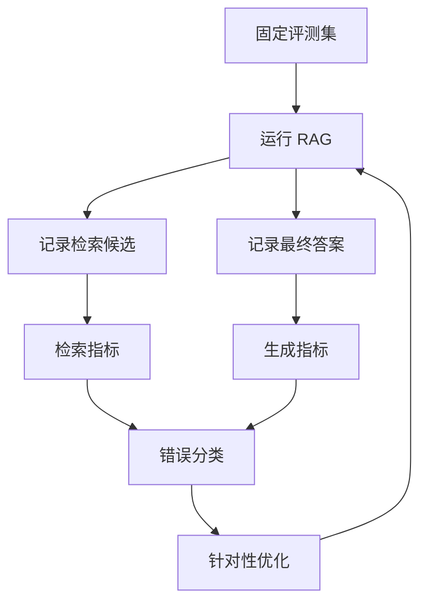

# 10. 评测与可观测性：不要凭感觉优化 RAG

> 模块：生成集成与评估  
> 建议学习时间：60 分钟

RAG 系统最容易陷入一种假进步：改了一个参数，挑几个问题试试，感觉好像更准了。企业系统不能靠感觉上线。评测和可观测性的作用，就是把“我觉得好”变成“在哪类问题上、因为什么变好或变差”。

## 本章目标
- 能解释为什么 RAG 必须有评测集。
- 能区分检索指标、生成指标和业务指标。
- 能设计一条 RAG 请求日志。
- 能用错误分类指导优化。

## 本章图解


## 核心知识点
### 1. 评测集让优化有同一把尺

评测集 是一组固定问题、期望答案、期望引用和评分规则。没有评测集，每次改动都像换题考试，无法比较。

RAG 优化常常有副作用：chunk 变大可能提升某些综合问题，却降低精确引用；top_k 增大可能提高召回，却引入噪声。固定评测集能看出取舍。

从真实业务问题开始收集：高频问题、容易错的问题、权限敏感问题、跨文档问题、拒答问题。每题写出标准答案或评分标准，以及应该引用哪些资料。

**放到真实场景里：**客诉答疑可以准备 50 个问题：退款、赔付、物流、特殊商品、超范围问题、旧规则干扰问题。

**容易踩的坑：**不要只放简单题。评测集太简单，系统会在演示中很好看，上线后很脆。

### 2. 检索指标和生成指标要分开看

答案错了，不一定是模型生成错。可能是正确资料没召回，也可能召回了但没放进上下文，还可能放进去了但模型没用。

检索指标看正确资料是否进入候选、排名是否靠前；生成指标看答案是否忠实、引用是否支撑结论、格式是否合规。

常见检索指标包括 hit@k、MRR、召回来源覆盖；生成指标包括 faithfulness、answer correctness、citation quality、format validity。

**放到真实场景里：**如果正确资料没有进 top 20，先修检索；如果进了 top 5 但答案没引用，修上下文和提示词；如果答案格式不对，修结构化输出。

**容易踩的坑：**不要用一个总分掩盖问题。总分下降 2 分，可能来自完全不同的根因。

### 3. 可观测性让每次回答都能回放

可观测性 是记录一次请求的输入、检索、重排、上下文、生成、引用、成本、耗时和用户反馈。

上线后用户报错时，你需要重放当时系统看到了什么资料、为什么选了这些片段、模型生成了什么、引用来自哪里。

日志至少记录 query、query_plan、retrieved_chunks、reranked_chunks、context_ids、answer、citations、latency、cost、model、error_type。

**放到真实场景里：**测试同学说“漏了验证码错误场景”，你可以查日志确认是资料没召回、被重排挤掉，还是生成时没覆盖。

**容易踩的坑：**不要只记录最终答案。最终答案无法帮助定位检索链路的问题。

## 错误分类比盲目调参更有用

RAG 错误通常可以分成资料缺失、解析清洗错误、分块错误、检索漏召回、重排排序错、上下文过长、生成不忠实、引用错误、权限错误。分类之后，优化才有方向。

| 错误类型 | 症状 | 优先修哪里 |
| --- | --- | --- |
| 资料缺失 | 知识库根本没有依据 | 补资料和数据血缘 |
| 分块错误 | 答案跨块断裂 | 调整 chunk 边界 |
| 检索漏召回 | 正确资料没进候选 | 混合检索/查询重写 |
| 重排错误 | 正确资料候选中但排名低 | rerank 和特征 |
| 生成不忠实 | 资料在上下文里但答案乱说 | 提示词/引用校验 |
| 权限错误 | 召回不可见资料 | 检索阶段权限过滤 |

### 先定位，再优化

很多团队一出错就调 prompt 或换模型，但如果正确资料没有召回，换再好的模型也只是更流畅地猜。错误分类能防止你修错层。

### 评测要包含回归

每次修复一个错误，都把它加入评测集。否则下次优化别的地方时，很可能把旧问题重新改坏。

#### 评测样例结构

```js
const evalCase = {
  question: "验证码错误是否计入密码错误次数？",
  expectedAnswer: "不计入。",
  expectedSources: ["login-rule-2026q1#captcha"],
  checks: ["retrieval_hit", "faithfulness", "citation_quality"]
};
```

**Takeaway：**RAG 优化不是玄学调参，而是基于日志和评测集的错误定位。

## 常见误区
- 只看最终答案无法定位问题。
- 评测集不能只放简单题和成功样例。
- 换模型不一定能解决检索错误。
- 用户反馈要进入评测回归，而不是只看一次。

## 从“感觉不错”走到“证据不错”

第十章是工程分水岭。没有评测和日志，RAG 只是一个会聊天的演示；有了评测和可观测性，它才开始像一个可以迭代的系统。

- 评测集提供固定尺子。
- 检索指标和生成指标要分开看。
- 请求日志要能回放每次回答。
- 错误分类决定优化顺序。

下一章会把前面所有组件合到企业架构里，看一个知识库从数据、服务、权限到发布到底怎么设计。

## 快速自测
1. 评测集的作用是什么？
   - A. 固定尺子
   - B. 美化页面
   - C. 删除引用
   - 答案：固定尺子

2. 正确资料没召回应先修什么？
   - A. 检索链路
   - B. 按钮颜色
   - C. 头像尺寸
   - 答案：检索链路

3. 可观测性不只记录什么？
   - A. 最终答案
   - B. 检索候选
   - C. 模型耗时
   - 答案：最终答案

4. 错误分类的价值是什么？
   - A. 定位优化方向
   - B. 替代资料
   - C. 隐藏问题
   - 答案：定位优化方向

## 练一下

为“客诉答疑 RAG”设计 10 条评测题，覆盖高频问题、旧版政策干扰、权限问题、拒答问题，并写出每题期望引用。

## 主要参考
- [Datawhale RAG 系统评估](https://github.com/datawhalechina/all-in-rag/blob/main/docs/chapter6/18_system_evaluation.md)
- [Datawhale RAG 评估工具](https://github.com/datawhalechina/all-in-rag/blob/main/docs/chapter6/19_common_tools.md)
- [内部 PDF：关于 RAG 优化的思考记录](../../../assets/关于%20RAG%20优化的思考记录.pdf)
