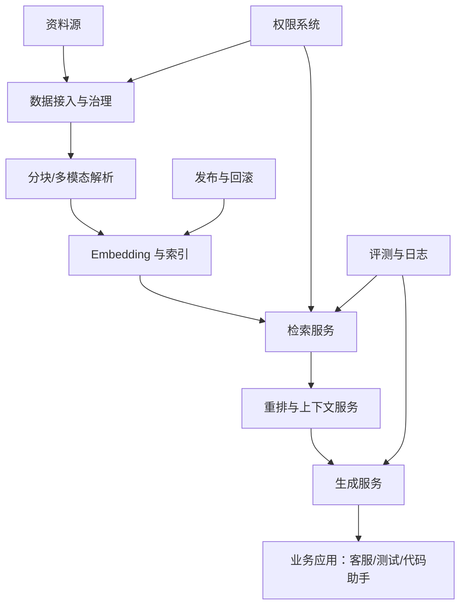

# 11. 企业级 RAG 架构：权限、更新、服务化与安全边界

> 模块：企业项目实战  
> 建议学习时间：60 分钟

到这里，我们已经学过数据、分块、向量、检索、生成和评测。第十一章把它们拼成一个企业系统。注意，这不是把所有高级词堆在一起，而是回答一个朴素问题：如果明天要给团队上线一个知识库，哪些模块不能少，哪些可以后补？

## 本章目标
- 能画出企业知识库的端到端架构。
- 能说明权限、版本、审计、更新在架构中的位置。
- 能理解 GraphRAG、Workflow RAG、Agentic RAG 的适用场景。
- 能设计一个企业 RAG MVP 的服务边界。

## 本章图解

## 核心知识点
### 1. 企业 RAG 要把离线链路和在线链路分开

离线链路负责资料治理、分块、嵌入、索引；在线链路负责接收问题、检索、重排、生成、记录日志。

两条链路的节奏不同。资料更新可以批处理、审核、发布；用户问答需要低延迟、可用性和权限控制。混在一起会让系统难维护。

把数据管道、索引服务、检索服务、生成服务、评测服务拆成边界清晰的模块。MVP 可以部署简单，但逻辑边界要清楚。

**放到真实场景里：**客服政策每天更新一次，离线链路夜间重建索引；在线客服问答白天稳定服务，并能回滚到上一版索引。

**容易踩的坑：**不要让用户查询触发随意入库和重建索引。在线链路要稳定，数据更新要可审核。

### 2. 权限和审计必须进入核心链路

企业知识库里的资料不是人人可见。权限不是 UI 功能，而是检索和生成的基础约束。

如果不可见资料进入候选片段，即使最终答案没有直接引用，也可能影响模型生成。审计则保证出了问题能追到人、资料和版本。

权限字段在入库时写入元数据，检索时按用户身份过滤，上下文组装时再次校验，日志记录用户、资料、答案和引用。

**放到真实场景里：**内部客服手册可以给客服坐席看，但不能给普通用户看；研发代码规范可以给内部工程师看，但不能进入公开问答。

**容易踩的坑：**不要等答案生成后再脱敏。模型已经看过不可见资料，风险就已经发生。

### 3. 企业 RAG 需要发布、回滚和版本治理

知识库不是一次性上传完就结束。资料会更新，索引会重建，评测会发现回归，业务也会要求回滚。

没有版本治理，今天的知识库和昨天有什么差异没人知道；答案变差也无法回到上一版。企业系统必须把知识库当成可发布的软件资产。

每次发布记录资料批次、清洗规则、分块参数、embedding 模型、索引版本、评测结果。上线后监控反馈，必要时回滚索引版本。

**放到真实场景里：**新赔付规则上线后，评测发现特殊商品例外条款召回失败，可以先回滚索引，再修复分块和元数据。

**容易踩的坑：**不要只版本化原始文件。清洗规则、分块参数和 embedding 模型同样影响结果。

### 4. GraphRAG 和 Agentic RAG 是进阶选项，不是 MVP 必需品

GraphRAG 用实体和关系组织知识，适合跨文档关系问题；Agentic RAG 让系统能规划多步检索和工具调用。

它们解决的是复杂推理、关系追踪、多源协作，不是所有知识库第一天都要上。MVP 先把资料、检索、引用、评测跑稳，再逐步引入。

当问题经常涉及“某客户、某产品、某缺陷、某版本之间的关系”时，可以考虑知识图谱；当问题需要查文档、查数据库、查代码多步协作时，可以考虑 Agentic RAG。

**放到真实场景里：**客户成功系统要回答“这个客户过去三个月的投诉、补偿和合同条款有什么关系”，GraphRAG 可能有价值。

**容易踩的坑：**不要用高级架构掩盖基础数据治理不足。脏数据上建图，只会得到更复杂的脏结果。

## 一个企业 RAG MVP 应该先保住哪些能力

第一版不需要把所有高级功能做满，但必须保住业务可信度。最低要求是：资料可控、权限可控、答案可引用、错误可复盘、版本可回滚。

| 能力 | MVP 做到什么 | 后续增强 |
| --- | --- | --- |
| 资料治理 | 来源、版本、权限、抽检 | 自动质量评分和血缘图 |
| 检索 | 混合检索 + 重排 | 多跳、Agentic、GraphRAG |
| 生成 | 引用、拒答、结构化输出 | 多模板、多角色答案 |
| 评测 | 固定评测集 + 请求日志 | 自动回归和线上 A/B |
| 发布 | 索引版本和回滚 | 灰度、审批流、变更影响分析 |

### MVP 不是粗糙版，而是边界清楚版

可以先少做功能，但不能少做引用、权限和日志。否则系统看似能回答，却无法被业务信任。

### 先服务一个场景，再扩成平台

客诉答疑、测试用例生成、代码库助手三者都能做，但第一版最好选一个主场景打穿，再抽象共同能力。

**Takeaway：**企业级不是功能堆满，而是关键风险被控制住：资料、权限、引用、评测、发布。

## 常见误区
- 企业 RAG 不是把 Demo 接到生产环境就完事。
- 权限不是前端展示问题，而是检索链路问题。
- GraphRAG 和 Agentic RAG 不应替代基础治理。
- 版本化只管文件是不够的，还要管索引和参数。

## 这一章把零件装成系统

第十一章的重点是架构边界。企业 RAG 至少要分清离线数据链路和在线问答链路，并把权限、审计、评测、发布放进核心流程。

- 离线负责治理和索引，在线负责检索和生成。
- 权限过滤要发生在检索阶段。
- 知识库要像软件一样发布、评测和回滚。
- 高级 RAG 能力应建立在基础链路稳定之后。

最后一章，我们会把所有知识落到一个毕业项目：从一个业务场景出发，搭一个可以演示、可以评测、可以解释的企业知识库。

## 快速自测
1. 企业 RAG 在线链路主要负责什么？
   - A. 检索生成
   - B. 清洗文件
   - C. 购买域名
   - 答案：检索生成

2. 权限过滤应该进入哪里？
   - A. 检索阶段
   - B. 答案之后
   - C. 页面底部
   - 答案：检索阶段

3. 知识库版本不只包括文件，还包括什么？
   - A. 索引参数
   - B. 背景图片
   - C. 用户头像
   - 答案：索引参数

4. MVP 必须保住什么？
   - A. 引用和日志
   - B. 复杂动画
   - C. 社交分享
   - 答案：引用和日志

## 练一下

为“客诉答疑知识库”画一张企业 RAG MVP 架构图，标出离线链路、在线链路、权限、评测、发布和回滚位置。

## 主要参考
- [内部 PDF：RAG 方案对比](../../../assets/RAG%20方案对比.pdf)
- [内部 PDF：大模型生码的原理与 RAG 工程实践](../../../assets/大模型生码的原理与%20RAG%20工程实践.pdf)
- [Datawhale 知识图谱 RAG](https://github.com/datawhalechina/all-in-rag/blob/main/docs/chapter7/20_kg_rag.md)
