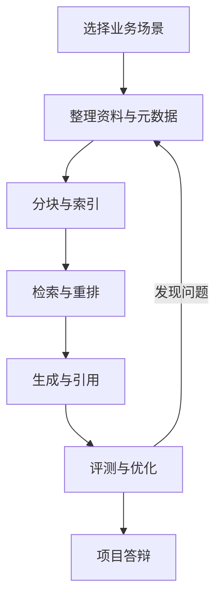

# 12. 毕业项目：搭建一个可解释的企业知识库

> 模块：企业项目实战  
> 建议学习时间：90 分钟 + 1-2 天实践

最后一章不再新增一堆术语，而是把前面学过的东西落到项目。你要做的不是一个炫技聊天框，而是一个可解释的企业知识库：它知道资料从哪来，为什么召回这些片段，答案依据是什么，什么时候应该拒答。

## 本章目标
- 能选择一个适合 RAG 的业务场景。
- 能整理资料、设计元数据、配置检索和回答规则。
- 能建立小型评测集并做一次优化。
- 能用架构图和证据讲清自己的方案。

## 本章图解


## 核心知识点
### 1. 先选一个真实、窄、可评测的场景

好项目不是范围越大越好。范围太大，资料治理和评测都会失控。第一版最好选一个明确业务场景。

适合入门的三个方向是客诉答疑、业务测试用例生成、代码库助手。它们都有明确资料源、问题类型和评测方式。

用五个问题筛选：用户是谁，资料在哪里，答案是否需要引用，错误后果是什么，能否准备 20 条评测题。

**放到真实场景里：**“公司全知识库助手”太大；“登录模块测试用例生成助手”更窄，也更容易做出效果。

**容易踩的坑：**不要先选工具。先选场景和资料，再决定用 Dify、FastGPT、AnythingLLM、LangChain 还是自研。

### 2. 项目交付要包含知识库，不只包含聊天界面

一个 RAG 项目的核心交付包括资料清单、元数据设计、分块策略、检索链路、回答规则、评测集和演示问题。

聊天界面只是入口。真正体现工程能力的是你能解释资料怎么进入系统、为什么这样切、为什么这样检索、答案如何引用、错误如何定位。

准备一份项目说明：场景、用户、资料源、架构图、关键配置、评测结果、已知限制、下一步优化。

**放到真实场景里：**测试用例生成项目应该展示：PRD、接口文档、历史缺陷、历史用例模板如何分别入库，以及生成的用例如何引用来源。

**容易踩的坑：**不要只录一段成功演示。答辩时一定会有人问：如果资料没有答案怎么办？如果旧资料冲突怎么办？

### 3. 评测和复盘决定项目是否可信

毕业项目至少要有 20 条评测题，覆盖正常问答、边界问题、拒答问题、旧资料干扰和权限问题。

没有评测，项目只能证明某几个问题答得不错；有评测，才能说明系统在哪些问题上稳定，哪些地方还需要优化。

先跑基线，再根据错误分类优化一次。记录修改前后：检索命中率、引用质量、答案正确性、格式合规率。

**放到真实场景里：**如果发现“历史缺陷”经常召回不到，就回到资料整理和检索链路，而不是直接要求模型“多想想”。

**容易踩的坑：**不要把评测结果只写成通过率。要写出典型错误和下一步计划，这才像真实工程复盘。

## 三条项目路线，选择一条打穿

课程最后推荐三条路线。它们难度不同，但都能覆盖 RAG 的核心链路。选择时不要贪多，先把一条路线做成可解释的闭环。

| 路线 | 资料源 | 核心难点 | 适合展示什么 |
| --- | --- | --- | --- |
| 客诉答疑 | 政策、FAQ、工单摘要 | 旧版规则干扰、拒答、引用 | 可追溯问答 |
| 测试用例生成 | PRD、接口、缺陷、用例模板 | 资料拆解、结构化输出 | 从知识到业务产物 |
| 代码库助手 | README、组件示例、类型定义、测试 | 代码结构、精确检索 | 研发提效场景 |

### 低代码路线也要讲清工程设计

使用 Dify、Coze、FastGPT 或 AnythingLLM 都可以，但不要只展示配置截图。要说明资料怎么治理、检索怎么配置、引用怎么验证、评测怎么做。

### 可选代码路线服务理解，不强迫炫技

如果学习者有编程基础，可以用 JavaScript 或 Java 伪代码描述服务边界；如果没有，也可以用流程图和配置表把架构讲清楚。

#### 项目说明最小目录

```js
const projectPackage = {
  scenario: "登录模块测试用例生成",
  documents: ["PRD", "接口文档", "历史缺陷", "用例模板"],
  metadata: ["source", "version", "domain", "docType", "permission"],
  evalSetSize: 20,
  outputs: ["架构图", "演示链接", "评测报告", "优化记录"]
};
```

**Takeaway：**毕业项目不是证明你会用某个工具，而是证明你能把资料、检索、生成、引用和评测组织成一个可信系统。

## 常见误区
- 项目范围越大不等于越高级。
- 低代码工具不代表不用做资料治理。
- 一次成功演示不能替代评测集。
- 毕业项目要能说明限制，而不是假装完美。

## 最后，把 RAG 讲成一个你能负责的系统

这门课从“模型凭什么知道答案”开始，到“如何搭一个可解释企业知识库”结束。你不需要一开始就成为算法专家，但要能把资料、检索、生成、评测这些环节说清楚、做出来、测一下、再优化。

- 先选窄场景，再做资料治理。
- 项目交付包含架构、资料、配置、评测和复盘。
- 引用、拒答、权限、日志是企业可信度的底座。

完成项目后，下一步可以往两个方向走：深入工程实现，或深入某个业务场景，把 RAG 和 Agent、工具调用、工作流结合起来。

## 快速自测
1. 毕业项目最好先选什么场景？
   - A. 窄且可评测
   - B. 越大越好
   - C. 完全无资料
   - 答案：窄且可评测

2. 项目交付不应只有什么？
   - A. 聊天界面
   - B. 评测报告
   - C. 资料清单
   - 答案：聊天界面

3. 评测题至少应覆盖什么？
   - A. 拒答问题
   - B. 页面背景
   - C. 头像尺寸
   - 答案：拒答问题

4. 低代码路线仍要说明什么？
   - A. 工程设计
   - B. 营销口号
   - C. 随机配置
   - 答案：工程设计

## 练一下

选择客诉答疑、测试用例生成、代码库助手三条路线之一，完成毕业项目计划书：场景、资料源、元数据、分块策略、检索链路、回答规则、20 条评测题、演示脚本。

## 主要参考
- [All-in-RAG 全栈指南](https://datawhalechina.github.io/all-in-rag/#/)
- [RAG 从入门到实战完整教程](https://rag.deeptoai.com/docs)
- [RAG Best Practices](https://github.com/ali-bahrainian/RAG_best_practices)
- [内部 PDF：关于 RAG 优化的思考记录](../../../assets/关于%20RAG%20优化的思考记录.pdf)
