# 1. RAG 的第一性问题：让模型从闭卷回答走向有据可查

> 模块：基础与全局视角  
> 建议学习时间：60 分钟

我们先别急着谈向量数据库，也别急着装工具。真正要回答的问题是：模型凭什么知道你公司的退款规则、登录限制、组件用法和历史缺陷？如果答案只来自模型训练时形成的参数化知识，它很容易说得像真的，却无法证明依据。RAG 的出场，就是为了把“查资料”这件事接进模型回答过程，让企业 AI 从闭卷考试变成开卷考试。

## 本章目标
- 能用一句话解释 RAG 解决的核心问题。
- 能区分 Prompt、搜索、RAG、微调四种方案。
- 能画出企业 RAG 的最小可行架构。
- 能判断哪些业务问题值得优先用 RAG。

## 本章图解
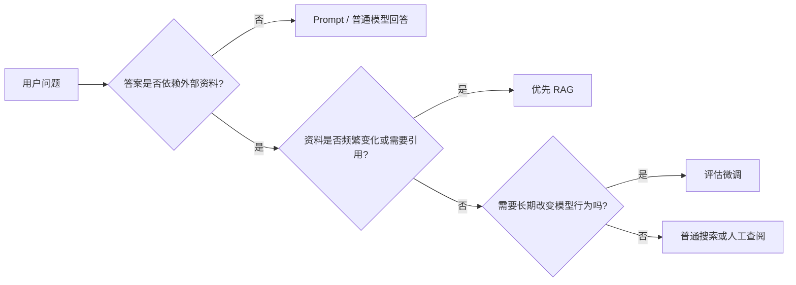

## 核心知识点
### 1. RAG 不是让模型更玄学，而是让答案多一层证据

RAG 的完整名字是 Retrieval-Augmented Generation，中文常翻译为检索增强生成。拆开看就很直白：先检索，再生成。检索负责找资料，生成负责组织答案。

大模型很擅长把语言组织得顺滑，但它不天然知道企业内部资料。比如 2026Q1 的退款规则、某个登录模块的异常流程、你们代码库里的组件约定，这些都不一定存在于模型参数里。RAG 把这些资料放在外部知识库中，用户提问时先找相关片段，再把片段交给模型。

一次最小 RAG 请求通常会经过四步：把用户问题转成检索请求；从知识库召回相关片段；把片段、引用、回答规则组装成上下文包；让 LLM 基于上下文回答。这里的重点是“基于上下文”，不是让模型自由发挥。

**放到真实场景里：**客服同学问“会员退款多久到账”，系统应该先找到最新退款政策，再回答并给出处；测试同学问“登录模块要覆盖哪些异常场景”，系统应该先找 PRD、历史缺陷和用例模板。

**容易踩的坑：**不要把 RAG 理解成“把所有文档塞给模型”。真正的 RAG 是只拿当前问题需要的资料，而且要保留来源，方便核对。

### 2. Prompt、搜索、RAG、微调解决的是四类不同问题

很多初学者会把这些词放在同一条升级路线上：Prompt 不行就 RAG，RAG 不行就微调。这个想法很自然，但不太准确。

Prompt 更像答题规范，解决“怎么答”的问题；搜索负责找资料，但不一定会组织答案；RAG 把找资料和生成答案连成流程；微调则是长期改变模型在某类任务上的稳定行为。它们可以组合，但不是互相替代。

一个简单判断是：缺外部事实，先看 RAG；缺输出格式，先调 Prompt；缺网页或公开信息，搜索可能够用；想让模型长期学会某种标注、风格或固定任务习惯，才认真考虑微调。

**放到真实场景里：**企业制度每周更新，用微调追版本会很痛苦；客服话术只是不够统一，先写清 Prompt 可能就够；代码库助手需要知道内部组件和示例，RAG 通常是更稳的起点。

**容易踩的坑：**不要因为 RAG 听起来更工程化，就把所有问题都做成 RAG。方案越复杂，排错和维护成本也越高。

### 3. 企业 RAG 的最小系统要能被检查

演示一个 RAG 原型不难，难的是它答错时你知道去哪里修。企业系统需要的不是“看起来会聊天”，而是每个环节都有证据。

最小系统至少包含资料源、清洗分块、索引、检索器、上下文组装、生成模型、日志和评测。少了资料源，答案没有根；少了日志，错误无法复盘；少了评测，优化只是凭感觉。

后面每学一个组件，都可以问同一个问题：它在这条链路里解决什么风险？分块减少检索不准，embedding 帮助语义匹配，rerank 改善排序，评测集让优化可比较。

**放到真实场景里：**如果测试用例生成漏掉“验证码错误不计入密码错误次数”，你需要追查：资料有没有入库，分块有没有切断，检索有没有召回，重排有没有排上来，模型有没有忽略。

**容易踩的坑：**不要只保存最终答案。只看答案，永远分不清是资料错、检索错，还是模型生成错。

## Prompt、搜索、RAG、微调：别拿一把锤子敲所有钉子

做方案选型时，先把问题拆成“事实从哪里来”和“答案怎么表达”。如果事实来自企业动态资料，RAG 更合适；如果事实早就在人类输入里，只是模型回答格式不稳定，Prompt 就能解决不少问题。微调不是万能升级，它更适合长期稳定的行为迁移。

| 方案 | 主要解决什么 | 更适合什么 | 不适合什么 |
| --- | --- | --- | --- |
| Prompt | 约束回答方式 | 固定格式、语气、拒答规则 | 补充模型不知道的企业事实 |
| 搜索 | 找到资料 | 人工查阅、公开资料定位 | 自动引用、权限控制、稳定生成 |
| RAG | 基于资料回答 | 企业知识库、测试用例生成、代码库助手 | 资料未整理、无评测闭环 |
| 微调 | 改变稳定行为 | 固定标注、风格迁移、重复任务习惯 | 频繁变化的政策和 PRD |

### 可以先用“三问法”粗判

第一问：答案是否依赖外部资料？第二问：资料是否经常变化或需要引用？第三问：问题是否只是格式、语气、结构不稳定？前两个问题都回答“是”，RAG 通常值得优先；第三个问题回答“是”，先从 Prompt 开始更省力。

### 技术选型本质上是在控制维护成本

如果你用微调追每周更新的制度，后续维护会很重；如果只是给模型补一点回答格式，却搭整套 RAG，也是在制造复杂度。好的选型不是“炫”，而是让未来的更新、排错和审核更轻。


**Takeaway：**第一章先记住一个判断：RAG 的价值不是让模型更会说，而是让模型回答前先看到可更新、可引用、可检查的资料。

## RAG 最小可行架构：从一次回答拆成可复盘流水线

一个企业 RAG 请求有两条线：资料线负责把知识准备好，问题线负责把当前提问变成可记录的回答。资料线通常离线运行，问题线在线运行。把两条线分清楚，后面学每个组件都会更顺。

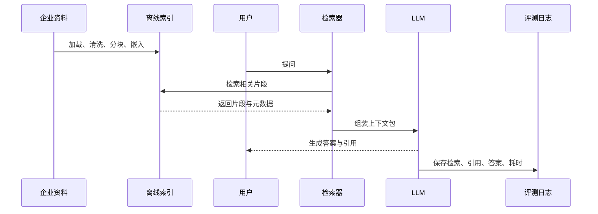

### 一次错误答案，通常能追到某个环节

资料缺失、分块错误、检索漏召回、重排排序错、上下文过长、模型忽略引用，都会造成错误答案。架构图不是装饰，它给每类错误留下了定位点。

### 伪代码先看输入输出，不急着学编程

下面这段代码只想表达一件事：问题进来后，系统先检索候选片段，再构造上下文，最后生成答案并写日志。后续所有优化，都会落在这些节点上。

#### RAG 请求的最小闭环

```js
async function answer(question, user) {
  const candidates = await retriever.search(question, {
    permissions: user.permissions,
    topK: 8
  });
  const context = buildContext(question, candidates);
  const result = await llm.generate(context);
  await auditLog.save({ question, candidates, result });
  return result;
}
```

**Takeaway：**把 RAG 看成流水线，学习会轻松很多。每个组件都不是孤立术语，而是在帮这条流水线更准、更稳、更容易被检查。

## 常见误区
- RAG 不是把所有资料塞进 Prompt，而是检索当前问题最需要的资料。
- RAG 不是微调的低配版，它们解决的问题不同。
- RAG 不是搜索框加聊天框，企业级系统还需要权限、引用、评测和日志。
- RAG 不能自动保证正确，资料质量和检索质量仍然决定上限。

## 这一章先收束成一句话

RAG 不是让模型突然拥有企业知识，而是把“先查资料、再带证据回答、最后能复盘”做成一条稳定流程。理解这一点，后面的分块、向量、检索、重排、评测都不会显得散。

- 缺格式，先看 Prompt；缺外部事实，再看 RAG；想长期改变模型行为，才考虑微调。
- RAG 至少要拆成资料准备、检索、上下文组装、生成、记录这几段。
- 企业场景里，能回答只是起点，能引用、能拒答、能复盘才是上线门槛。

下一章我们把镜头往前推一步：既然答案要依赖资料，那资料进入系统之前，究竟要被整理成什么样？

## 快速自测
1. RAG 最核心的顺序是什么？
   - A. 先检索再生成
   - B. 先训练再上线
   - C. 先美化再发布
   - 答案：先检索再生成

2. 企业政策每周更新，更适合优先使用什么？
   - A. RAG
   - B. 长期微调
   - C. 只靠语气
   - 答案：RAG

3. 只想统一答案格式，通常先优化什么？
   - A. Prompt
   - B. 权限系统
   - C. 向量维度
   - 答案：Prompt

4. RAG 上线前必须能复盘什么？
   - A. 检索和引用
   - B. 按钮颜色
   - C. 头像尺寸
   - 答案：检索和引用

## 练一下

选择一个业务问题，按“是否依赖外部资料、资料是否变化、是否需要引用、是否涉及权限、错误后果是什么”五个维度判断它适合 Prompt、搜索、RAG 还是微调。

## 主要参考
- [Datawhale RAG 简介](https://github.com/datawhalechina/all-in-rag/blob/main/docs/chapter1/01_RAG_intro.md)
- [RAG 经典论文](https://arxiv.org/abs/2005.11401)
- [LlamaIndex RAG 入门](https://developers.llamaindex.ai/python/framework/understanding/rag/)


---

# 2. 数据进入系统之前：从原始资料到可检索知识物料

> 模块：数据处理全流程  
> 建议学习时间：60 分钟

上一章我们说，RAG 的关键是让模型先查可信资料。问题是：企业资料天然并不可信。它们可能重复、过期、格式混乱、权限不清。直接上传一堆 PDF 或 PRD，往往只是把混乱搬进知识库。第二章要解决的是：资料进入 RAG 前，怎样变成可管理、可检索、可引用、可控权的知识物料。

## 本章目标
- 能列出 RAG 常见数据源，并说明每类数据的解析风险。
- 能解释加载、解析、清洗、结构化、权限标注的顺序。
- 能设计一条企业知识物料的最小元数据。
- 能判断数据质量问题会怎样影响检索和生成。

## 本章图解
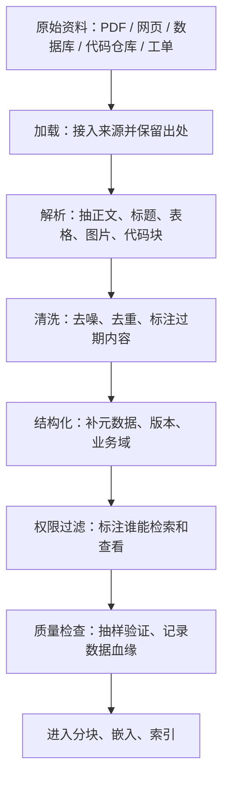

## 核心知识点
### 1. 数据加载要保留来路，不只是把文字读出来

加载是 RAG 数据管道的第一步，负责把 PDF、Word、Markdown、HTML、数据库、API、代码仓库、客服工单等来源接入系统。

不同来源的资料结构差异很大。PDF 有页眉页脚、多栏排版和表格；网页有导航、广告和脚本；代码仓库有 README、类型定义、示例、测试和提交记录。加载阶段如果丢了来源、页码、标题和文件版本，后面就很难引用和排错。

加载时先判断资料类型，再选择解析器或连接器。文字型 PDF 抽正文和标题；扫描件先 OCR；表格保留行列关系；网页提取正文；代码仓库优先读取 README、示例、接口定义和测试。

**放到真实场景里：**做代码库助手时，直接吞全部源码并不聪明。更稳的是先加载 README、组件示例、类型定义、测试用例和常见错误修复记录，因为这些资料更接近用户会问的问题。

**容易踩的坑：**不要把“文件已经读出来”当作“资料已经准备好”。抽取顺序错、表格丢列、代码块被拆散，都会在后续检索里变成错误上下文。

### 2. 清洗不是美化文本，而是减少未来的错误召回

清洗处理重复、过期、乱码、页眉页脚、广告、草稿、格式错乱等问题；标准化把标题、列表、表格、代码块、时间格式整理成一致结构。

RAG 遵循 GIGO：低质量输入会直接污染输出。重复资料会让某些片段过度召回，旧政策会和新政策竞争，页眉页脚会污染每个 chunk，草稿和正式稿混在一起会让模型引用错误版本。

常见做法包括删除重复页眉页脚、合并重复文档、标注废弃版本、保留表格和代码块结构、统一标题层级、抽样检查清洗结果。清洗规则也要记录下来，否则下次更新资料时无法复现。

**放到真实场景里：**客诉答疑知识库里，如果 2025 版赔付规则和 2026Q1 版赔付规则同时存在，但没有版本字段，用户问最新政策时系统可能召回旧规则。

**容易踩的坑：**清洗过度也会出问题。把章节编号、页码、标题全部删掉，引用会失去锚点；把表格压成一段自然语言，字段关系会变模糊。

### 3. 元数据和权限是企业知识库的控制面板

元数据 是描述资料的数据，例如来源、标题、版本、更新时间、业务域、负责人、权限、文档类型、状态。权限过滤 决定某个用户是否可以检索和查看这条资料。

只靠语义相似度，系统很难区分新版政策和旧版政策、公开帮助文档和内部客服手册、移动端登录规则和后台登录规则。元数据让系统先缩小范围再检索，权限过滤则避免越权召回。

最小字段可以从这些开始：id、source、title、version、domain、doc_type、owner、permission、updated_at、effective_from、status。在线检索时，先根据用户身份、业务域、版本等字段过滤，再做向量或关键词检索。

**放到真实场景里：**生成登录模块测试用例时，系统可以先过滤 domain=login、doc_type in [prd,business_rule,test_case]、version=2026Q1，再检索“密码错误锁定”。

**容易踩的坑：**权限不能只靠前端隐藏。真正可靠的做法是在检索阶段就过滤不可见资料，否则模型可能基于用户无权查看的片段生成答案。

### 4. 数据血缘让错误有地方可追

数据血缘 记录资料从哪里来、经过哪些处理、进入了哪个索引。质量检查则通过抽样、对账和小型评测确认资料是否真的可用。

RAG 系统出错时，最怕只看到一个错误答案，却不知道问题来自原文、解析、清洗、分块、索引还是权限。数据血缘和质量检查可以把错误定位到具体环节。

每批资料入库后至少检查四件事：来源能否打开，正文是否完整，元数据是否齐全，权限是否正确。再用 5-10 个真实问题试检索，看正确资料是否能进入候选结果。

**放到真实场景里：**如果测试同学发现“验证码错误不计入密码错误次数”没有被召回，你需要能回到原始 PRD，确认它是否被加载、是否被清洗掉、是否被切分到错误位置、是否被权限过滤挡住。

**容易踩的坑：**不要等到用户投诉才开始做质量检查。资料入库当天就应该抽样验证，否则后续错误会被索引和缓存放大。

## 把 PRD 变成测试用例生成所需的知识物料

如果目标是让 RAG 帮测试同学生成登录模块测试用例，直接上传一份 PRD 通常不够。模型不仅要知道功能目标，还要知道业务规则、边界条件、异常流程、接口字段、历史缺陷、历史用例格式。更好的做法是把一份大 PRD 拆成多类知识物料，每类物料服务一种检索目的。

| 物料类型 | 应该保留什么 | 为什么重要 |
| --- | --- | --- |
| 业务规则 | 规则描述、适用范围、例外条件、版本 | 生成用例时决定覆盖哪些正常和异常路径 |
| 接口字段 | 字段含义、必填、枚举、错误码、版本 | 避免模型编造字段或漏掉错误码场景 |
| 异常流程 | 触发条件、提示文案、恢复路径、升级规则 | 测试用例最容易遗漏的部分通常在异常流程 |
| 历史缺陷 | 缺陷原因、复现步骤、修复说明、关联版本 | 把过去踩过的坑转成未来用例的检查点 |
| 用例模板 | 前置条件、步骤、预期结果、优先级格式 | 让生成结果能直接被测试同学接收和修改 |

### 知识物料不是原文切片，而是面向问题整理出的单元

比如“一条密码错误锁定规则”通常比“PRD 第 6 页的一半内容”更适合被检索和引用。前者天然带着问题、边界和用途，后者只是文档位置。

### 整理资料时，先从用户会问什么倒推

用户会问规则，就整理规则物料；会问字段，就整理接口物料；会问测试覆盖，就整理历史用例和缺陷物料。这个顺序比“先上传再说”更稳。


**Takeaway：**知识物料设计的核心观点：不是资料越完整越好，而是资料越适合被检索、引用和评测越好。

## 企业数据入库流水线：加载之后还要过四道关

很多 RAG 原型失败，是因为把“上传文件”当成了“数据治理”。企业里更稳的做法，是把资料入库做成流水线：每一批资料都要经过解析检查、清洗检查、元数据检查、权限检查，最后才允许进入分块和索引。

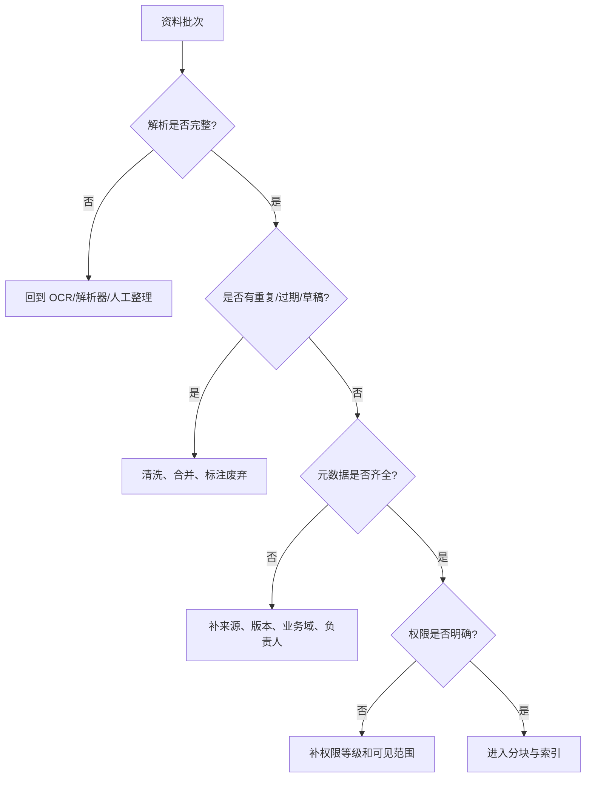

### 前两关看结构和噪声

解析检查确认正文、表格、代码和图片说明没有丢；清洗检查确认重复、过期、草稿、页眉页脚这些噪声已经被处理。很多检索问题，其实第一步解析就已经埋雷。

### 后两关看定位和安全

元数据检查确认资料能被过滤、引用和追溯；权限检查确认用户不会检索到不该看的内容。旧规则一旦进入索引，后续还会污染缓存、引用和评测记录。

#### 统一文档对象示例

```js
const document = {
  id: "login-lock-rule-2026q1",
  content: "连续 5 次密码错误后，账号锁定 15 分钟。",
  metadata: {
    source: "登录模块 PRD",
    version: "2026Q1",
    domain: "login",
    docType: "business_rule",
    owner: "QA Team",
    permission: "internal",
    status: "active"
  }
};
```

#### 统一文档对象示例

```java
record RagDocument(
  String id,
  String content,
  Map<String, String> metadata
) {}

RagDocument document = new RagDocument(
  "login-lock-rule-2026q1",
  "连续 5 次密码错误后，账号锁定 15 分钟。",
  Map.of(
    "source", "登录模块 PRD",
    "version", "2026Q1",
    "domain", "login",
    "docType", "business_rule",
    "permission", "internal",
    "status", "active"
  )
);
```

**Takeaway：**企业数据入库的核心观点：先把资料治理成稳定输入，再讨论分块、向量和检索。否则后面的优化都像是在脏水里调参。

## 常见误区
- 资料越多不等于系统越好，未治理资料越多，噪声越大。
- 只上传 PDF 不等于完成数据准备，解析、清洗、元数据和权限同样关键。
- 元数据不是备注，而是检索、引用、权限和评测的基础设施。
- 权限不能等到答案生成后再处理，检索阶段就要过滤。

## 到这里，先把“数据”这件事落稳

第二章其实只讲一个判断：原始资料不能直接等同于知识库。RAG 需要的不是一堆文件，而是一批带来源、版本、权限、业务域和用途的知识物料。资料进系统前整理得越清楚，后面检索和生成越少靠运气。

- 加载时保留来源，否则后面无法引用和排错。
- 清洗不是美化文本，而是减少旧资料、重复内容和格式噪声。
- 元数据和权限决定系统能否过滤、追溯和控权。
- 知识物料要从用户问题倒推，而不是从文件页码随机切。

下一章开始讲文本分块。到那时我们切的就不是一堆乱文档，而是一批已经有来源、版本、权限和用途的知识物料。

## 快速自测
1. PDF 扫描件进入 RAG 前通常先做什么？
   - A. OCR 或整理
   - B. 直接微调
   - C. 删除来源
   - 答案：OCR 或整理

2. 旧版政策和新版政策最适合靠什么区分？
   - A. 版本元数据
   - B. 字体大小
   - C. 随机排序
   - 答案：版本元数据

3. 权限控制应该尽早发生在哪里？
   - A. 检索阶段
   - B. 截图阶段
   - C. 配色阶段
   - 答案：检索阶段

4. 知识物料设计应优先反推什么？
   - A. 用户问题类型
   - B. 文件名长度
   - C. 页面颜色
   - 答案：用户问题类型

## 练一下

为“登录模块测试用例生成”设计 6 条知识物料：至少包含业务规则、接口字段、异常流程、历史缺陷、历史用例模板。每条写出 content 摘要和 6 个元数据字段。

## 主要参考
- [Datawhale RAG 数据加载](https://github.com/datawhalechina/all-in-rag/blob/main/docs/chapter2/04_data_load.md)
- [内部 PDF：RAG 方案对比](../../../assets/RAG%20方案对比.pdf)
- [RAG 从入门到实战完整教程](https://rag.deeptoai.com/docs)


---

# 3. 文本分块：别让好资料输在切法上

> 模块：数据处理全流程  
> 建议学习时间：60 分钟

上一章我们把资料整理成知识物料，这一章要决定它们怎么被切开。分块看起来像预处理小事，实际很像给一本书做书签：书签太少，翻半天找不到句子；书签太碎，又看不懂上下文。RAG 的检索质量，很多时候从这里就已经被决定了。

## 本章目标
- 能解释为什么长文档必须切成 chunk。
- 能比较固定、递归、语义、结构化分块。
- 能理解 chunk_size 与 overlap 的取舍。
- 能为制度、代码、测试用例设计分块策略。

## 本章图解
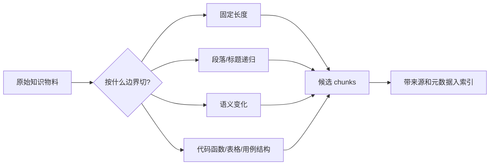

## 核心知识点
### 1. 分块的目标不是切小，而是切得可被找回

长文档不能原样进入 RAG。输入太长会被截断，语义太杂会让向量表示变得模糊，引用范围太大也会让用户难以核对。

一个 chunk 应该尽量围绕一个相对完整的问题。比如“密码错误锁定规则”可以独立回答一个问题，而“登录 PRD 第 4-7 页”包含页面、接口、异常和埋点，主题太散。

先按资料类型决定边界。制度按条款，FAQ 按问答，代码按函数或组件，测试用例按前置条件、步骤、预期结果。切完后，每个 chunk 仍然要带来源、标题、版本和权限。

**放到真实场景里：**如果用户问“连续输错密码会怎样”，一个专门讲锁定规则的小 chunk 比一整节登录说明更容易被召回，也更容易被引用。

**容易踩的坑：**不要只盯着字数。两个 500 字 chunk 的质量可能完全不同，关键看它是否围绕一个可回答的问题。

### 2. chunk_size 和 overlap 是取舍，不是神奇参数

chunk 的目标大小决定每个检索单元容纳多少信息；overlap 让相邻块共享一部分内容，减少边界信息被切断。

块太大，主题混杂，embedding 会被稀释；块太小，规则和条件可能分离。overlap 可以救边界，但过多会增加重复内容，导致索引体积变大、召回结果互相挤占。

可以从经验值开始，而不是追求一次调准：短 FAQ 用较小块和少重叠；长制度按条款切，必要时保留上一条标题；代码示例按函数和注释切；测试用例按用例单元切。

**放到真实场景里：**退款政策里“7 天无理由”和“特殊商品除外”如果被切到两个完全不相邻的块，模型可能只看到前半句，给出不完整答案。

**容易踩的坑：**overlap 不是越大越安全。重叠过大时，检索结果里会出现一堆相似块，看似召回很多，实际信息密度下降。

### 3. 结构化资料要尊重原来的结构

Markdown 标题、HTML 节点、表格行列、代码函数、测试用例字段，本身就是作者留下的结构线索。

如果把表格压成一段普通文本，字段关系会变模糊；如果把代码函数从注释和示例中切开，用户问法和答案依据可能分离。结构化分块的优势，是尽量不破坏资料原有语义边界。

处理 Markdown 时保留标题路径；处理表格时保留表头和行上下文；处理代码时保留函数签名、注释和相邻示例；处理测试用例时保留前置条件、步骤、预期结果。

**放到真实场景里：**代码库助手回答“Button 组件 disabled 怎么用”时，需要组件说明、类型定义和示例代码一起出现，而不是只召回某一行 prop。

**容易踩的坑：**固定长度分块很容易做，但对企业文档未必够。越是高价值资料，越值得花时间做结构感知。

## 为什么大块明明包含答案，却还是检索失败

假设一个大 chunk 同时包含登录规则、退款规则和库存扣减。用户问“密码错误几次会锁定”，答案确实在这个块里，但这个块的向量表示会同时受三个主题影响，整体语义变得发散。检索时，它可能输给一个标题更接近但内容不完整的片段。

| 问题位置 | 大块带来的影响 | 更好的处理 |
| --- | --- | --- |
| 检索端 | 向量表示笼统，相关性得分下降 | 让每个 chunk 聚焦单一主题 |
| 生成端 | 无关内容进入上下文，模型分心 | 只提供回答所需资料 |
| 引用端 | 引用范围过大，用户难核对 | 引用到条款或用例级别 |
| 评测端 | 难定位是切分错还是检索错 | 记录 chunk id 和来源路径 |

### 分块失败会同时拖累检索和生成

检索找不到正确块，生成自然没法答；即使找到了，过大的上下文也会把答案埋在中间。很多所谓模型幻觉，根因其实是资料切得不好。

### 先让 chunk 可以回答一个小问题

检验分块质量的简单办法：拿一个 chunk 问自己，它能独立支撑一个明确问题吗？如果不能，可能太碎；如果能支撑十几个问题，可能太大。

#### 递归分块的核心思想

```js
function splitByStructure(text, maxSize) {
  const separators = ["\n## ", "\n### ", "\n\n", "。"];
  return recursiveSplit(text, separators, maxSize, { overlap: 80 });
}
```

#### 递归分块的核心思想

```java
List<String> splitByStructure(String text, int maxSize) {
  List<String> separators = List.of("\n## ", "\n### ", "\n\n", "。");
  return recursiveSplit(text, separators, maxSize, 80);
}
```

**Takeaway：**分块不是清洗后的机械切割，而是把资料整理成最适合被检索、引用、评测的小知识单元。

## 常见误区
- chunk_size 越大不等于越完整，可能只是更吵。
- overlap 不是保险丝，太多会制造重复噪声。
- 固定长度分块适合原型，不一定适合企业资料。
- 分块策略要跟资料类型绑定，不要一套参数打天下。

## 这一章可以先记住两个判断

好的分块让知识物料既保持语义完整，又足够聚焦。它不追求把文本切得平均，而是让系统在用户提问时更容易找到、引用和核对。

- 制度按条款，FAQ 按问答，代码按函数和示例，测试用例按用例结构。
- chunk_size 控制信息密度，overlap 控制边界连续性。
- 每个 chunk 都应该保留来源、标题路径、版本和权限。

有了 chunk，下一章就要把它们变成向量。也就是让机器能计算“这段资料和这个问题有多像”。

## 快速自测
1. chunk 太大的主要风险是什么？
   - A. 主题被稀释
   - B. 引用更精确
   - C. 成本归零
   - 答案：主题被稀释

2. overlap 的主要作用是什么？
   - A. 减少边界断裂
   - B. 替代权限
   - C. 训练模型
   - 答案：减少边界断裂

3. 代码资料更适合按什么切？
   - A. 函数和示例
   - B. 随机字数
   - C. 文件颜色
   - 答案：函数和示例

4. 分块后必须保留什么？
   - A. 来源元数据
   - B. 浏览器缓存
   - C. 按钮样式
   - 答案：来源元数据

## 练一下

为三类资料分别设计分块策略：客服制度、代码组件示例、测试用例文档。写出 chunk 边界、目标大小、overlap 和必须保留的元数据。

## 主要参考
- [Datawhale RAG 文本分块](https://github.com/datawhalechina/all-in-rag/blob/main/docs/chapter2/05_text_chunking.md)
- [RAG Best Practices](https://github.com/ali-bahrainian/RAG_best_practices)
- [内部 PDF：关于 RAG 优化的思考记录](../../../assets/关于%20RAG%20优化的思考记录.pdf)


---

# 4. 向量嵌入与向量数据库：让资料可以被语义找到

> 模块：索引构建与优化  
> 建议学习时间：60 分钟

分块之后，我们得到很多知识小片段。但用户不会按片段标题提问，他们会用自然语言问：“退款多久到账？”“这个组件怎么禁用？”embedding 的作用，就是把问题和资料都转成可比较的数字表示，让系统能找到语义接近的内容。

## 本章目标
- 能解释 embedding 在 RAG 里的作用。
- 能说明向量数据库保存的不只是向量。
- 能理解相似度、索引、过滤、更新的基本关系。
- 能判断语义相似为什么不等于业务正确。

## 本章图解
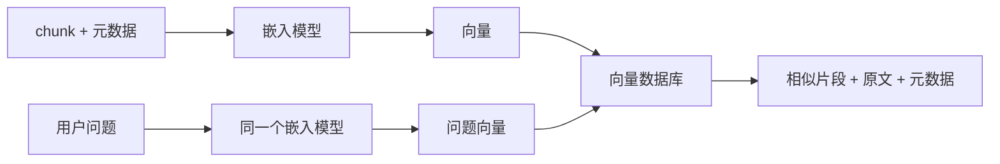

## 核心知识点
### 1. embedding 像语义坐标，但不是业务判断

embedding 会把文本映射成向量。语义相近的句子，向量距离通常更近，比如“退款多久到账”和“退钱几天到”关键词不同，但意思接近。

这个能力让 RAG 不必完全依赖关键词。用户问法可以变化，系统仍然有机会找到相关资料。它解决的是“自然语言表达不一致”的问题。

入库时，每个 chunk 生成一个向量；查询时，用户问题也生成一个向量；系统计算问题向量与资料向量的距离，返回最相似的候选片段。

**放到真实场景里：**客服知识库里，用户说“退钱什么时候到”，制度写的是“退款到账时效”，embedding 能把两者联系起来。

**容易踩的坑：**语义相似不等于业务适用。旧版政策和新版政策也很像，内部手册和公开文档也很像，这些必须靠元数据过滤。

### 2. 向量数据库保存向量，也保存可追溯的上下文

很多人听到向量数据库，以为里面只有一串数字。实际 RAG 需要保存向量、原文、来源、页码、标题、版本、权限、业务域等信息。

向量负责找相似，原文负责生成答案，元数据负责过滤、引用、权限和评测。只保存向量，系统无法回答“这个答案来自哪里”。

常见记录结构是 id、vector、content、metadata。metadata 里至少包含 source、title、version、domain、permission、updated_at、chunk_path。

**放到真实场景里：**生成测试用例时，系统可以先过滤 domain=login 和 doc_type=test_case，再做向量检索，避免召回无关客服政策。

**容易踩的坑：**不要把向量库当成普通文件夹。没有更新、删除、版本替换策略，知识库很快就会堆满旧资料。

### 3. 索引优化是在召回、延迟、成本、更新之间做平衡

索引让向量搜索更快，但不同索引策略会影响速度、召回率和资源成本。数据量小的时候简单方案够用，数据量大时才需要复杂优化。

企业 RAG 通常同时关心四件事：正确资料能不能找到，用户等多久，存储和计算花多少钱，资料更新后能不能快速生效。

可以从小规模精确搜索开始，再根据数据量引入近似索引；用元数据过滤减少候选范围；用批量入库降低成本；用增量更新替代全量重建。

**放到真实场景里：**一个 500 篇 FAQ 的知识库不需要复杂索引；一个跨产品、跨权限、上百万片段的企业库，就要认真设计索引和过滤策略。

**容易踩的坑：**不要只追求速度。检索很快但找不对资料，业务上等于没用。

## 语义相似为什么会骗过你

向量检索擅长找意思像的内容，但企业问答关心的是“这个内容对当前用户、当前版本、当前场景是否可用”。相似度只是候选依据，不是最终答案。

| 看起来相似的资料 | 潜在问题 | 应该加的控制 |
| --- | --- | --- |
| 2025 退款规则 vs 2026 退款规则 | 旧规则污染答案 | version / effective_from |
| 客服内部手册 vs 用户公开帮助 | 权限越界 | permission / audience |
| 移动端登录 vs 管理后台登录 | 场景错配 | domain / product |
| 历史缺陷 vs 当前修复说明 | 状态不明 | status / fixed_version |

### 先过滤，再相似度检索

更稳的顺序通常是：先用权限、版本、业务域缩小范围，再在范围内做向量或关键词检索。这样系统不是在整个知识海里捞针，而是在正确的池子里找鱼。

### 相似度分数不是质量分数

分数高只说明文本表达相近，不说明资料新、权威、可见、完整。上线前要用评测集观察命中率和引用质量，不能只看单次分数。

#### 带过滤条件的向量检索

```js
const results = await vectorDb.search({
  vector: await embed(question),
  topK: 12,
  filter: {
    domain: "login",
    version: "2026Q1",
    permission: { in: user.permissions }
  }
});
```

#### 带过滤条件的向量检索

```java
SearchRequest request = SearchRequest.builder()
  .vector(embed(question))
  .topK(12)
  .filter(Map.of(
    "domain", "login",
    "version", "2026Q1",
    "permission", user.permissions()
  ))
  .build();
```

**Takeaway：**embedding 帮你找到“像”的资料，元数据帮你判断“该不该用”。企业 RAG 两者缺一不可。

## 常见误区
- embedding 不是理解万物，它只是语义表示。
- 向量数据库不只存向量，还要存原文和元数据。
- 相似度高不代表资料适用于当前用户。
- 索引优化不只是提速，也要关注召回和更新。

## 把向量想成一张语义地图

第四章解决的是“机器怎么按意思找资料”。chunk 被转成向量后，系统可以用相似度找到候选片段；但企业场景还必须叠加版本、权限、业务域这些硬条件。

- embedding 让自然语言问法可以和资料语义对齐。
- 向量数据库要同时保存 vector、content、metadata。
- 语义检索必须和元数据过滤配合使用。

下一章会把这张地图扩展到图片、表格、截图和多模态资料，因为企业知识从来不只躺在纯文本里。

## 快速自测
1. embedding 主要解决什么？
   - A. 语义匹配
   - B. 页面配色
   - C. 用户登录
   - 答案：语义匹配

2. 向量库中 content 用来做什么？
   - A. 生成上下文
   - B. 压缩图片
   - C. 重启服务
   - 答案：生成上下文

3. 旧版和新版政策应靠什么区分？
   - A. 版本元数据
   - B. 字体大小
   - C. 随机排序
   - 答案：版本元数据

4. 检索很快但找错资料说明什么？
   - A. 质量仍不够
   - B. 系统已完美
   - C. 无需评测
   - 答案：质量仍不够

## 练一下

设计一条向量库记录结构，包含 id、content、vector、metadata。metadata 至少写出 8 个字段，并说明哪个字段用于权限、哪个用于版本、哪个用于引用。

## 主要参考
- [Datawhale RAG 向量嵌入](https://github.com/datawhalechina/all-in-rag/blob/main/docs/chapter3/06_vector_embedding.md)
- [Datawhale RAG 向量数据库](https://github.com/datawhalechina/all-in-rag/blob/main/docs/chapter3/08_vector_db.md)
- [Datawhale RAG 索引优化](https://github.com/datawhalechina/all-in-rag/blob/main/docs/chapter3/10_index_optimization.md)
- [OpenAI Embeddings 文档](https://developers.openai.com/api/docs/guides/embeddings)


---

# 5. 多模态文档理解：PDF、表格、图片和截图如何进入 RAG

> 模块：索引构建与优化  
> 建议学习时间：60 分钟

真实企业资料很少是干净 Markdown。它可能是一份扫描 PDF、一张流程图、一个产品截图、一张接口表格，甚至是一段带注释的代码截图。如果系统只会读纯文本，就会漏掉很多关键知识。

## 本章目标
- 能解释多模态 RAG为什么重要。
- 能区分文本、表格、图片、截图的处理方式。
- 能理解 OCR、版面解析、图片描述和表格结构保留。
- 能设计一个文档理解入库流程。

## 本章图解
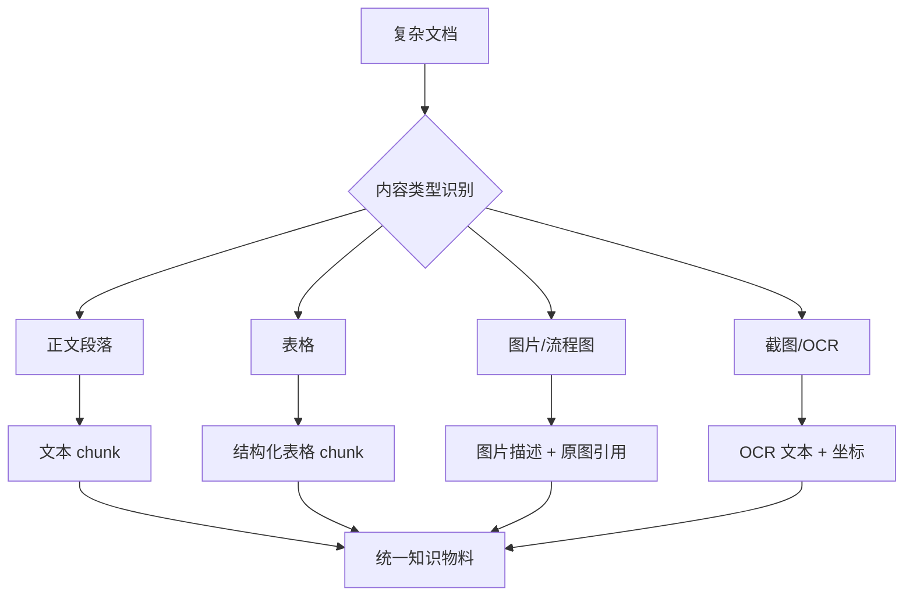

## 核心知识点
### 1. 多模态不是炫技，而是避免资料缺页

很多关键规则藏在表格、截图和流程图里。只抽正文会让知识库看起来很大，实际缺少最重要的部分。

比如接口错误码表、审批流程图、登录异常截图、测试用例 Excel，这些资料如果被简单转成散乱文本，字段关系和视觉含义都会丢失。

入库时先识别内容类型：正文用文本解析，表格保留行列和表头，图片生成可引用的说明，扫描件先 OCR，复杂版面保留页码和坐标。

**放到真实场景里：**生成测试用例时，错误码表决定异常场景；如果表格列关系丢了，模型可能把错误码、提示文案和处理动作拼错。

**容易踩的坑：**不要只看解析后有没有文字。要检查文字是否保留了原来的结构关系。

### 2. 表格要保留关系，不要压成一坨话

表格的价值在行列关系。字段名、枚举值、错误码、适用条件，往往靠列头才能解释清楚。

如果把表格直接按行拼成自然语言，检索时可能还能召回，但生成时容易把不同列的含义混在一起。更好的做法是让每个表格 chunk 保留表头、行号、标题和来源。

可以把表格转成 Markdown 表格、JSON 行对象，或者“表头 + 当前行 + 说明”的结构。关键是让模型能看懂每个单元格属于哪一列。

**放到真实场景里：**接口文档里的 required、type、default、description 如果丢了列名，模型很容易编造字段约束。

**容易踩的坑：**不要为了追求纯文本统一，把表格结构洗掉。RAG 不是只能吃自然语言。

### 3. 图片和截图要同时保留描述与原始位置

图片可以生成文字说明，但说明不应替代原图。复杂流程图、界面截图、架构图，都需要保留原始文件位置以便核验。

图片描述解决检索问题：用户问“审批流程怎么走”，系统能召回流程图说明。原图位置解决核验问题：用户可以点回来源确认节点和箭头。

常见做法是：给图片生成 caption 或 summary；记录 page、bbox、image_id；必要时把图中 OCR 文本、视觉描述和上下文标题合并成知识物料。

**放到真实场景里：**产品截图中“账号锁定提示文案”可能没有出现在正文里，但 OCR 能抽出提示文案，图片描述能说明它出现在哪个页面状态。

**容易踩的坑：**不要让视觉模型的描述变成唯一事实。图片描述也可能漏看或误读，必须保留原始引用。

## 一份 PDF 进入知识库前，最好先过一次“体检”

PDF 是 RAG 里最容易制造假象的资料：文件看起来完整，解析后却可能少表格、乱顺序、漏页眉、把两栏文字串错。一个可靠流程会先做版面识别，再按内容类型分别处理。

| 检查项 | 常见问题 | 处理方式 |
| --- | --- | --- |
| 文字层 | 扫描件没有可选中文本 | OCR 并记录置信度 |
| 阅读顺序 | 多栏排版串行错误 | 版面解析后按区块排序 |
| 表格 | 行列被打散 | 保留表头和行对象 |
| 图片 | 流程图被忽略 | 生成描述并保留原图引用 |
| 页码 | 引用无法定位 | 记录 page 和 bbox |

### 复杂资料要分类型处理

正文、表格、图片、代码块的最佳处理方式不同。统一入口可以有，但处理策略不能只有一种。

### 质量抽检比工具选择更重要

工具再好也会解析错。每批复杂文档入库后，都应该抽几页核对：正文顺序、表格结构、图片说明、引用位置是否可信。


**Takeaway：**多模态 RAG 的目标不是“什么都能读”，而是让复杂资料变成可检索、可引用、可核验的知识物料。

## 常见误区
- OCR 出文字不代表理解正确。
- 图片描述不能替代原始图片引用。
- 表格不要无脑转成普通段落。
- 多模态不是第一天就必须上，但复杂企业文档迟早会遇到。

## 把文档当成一个小系统来读

第五章补齐了纯文本之外的世界。企业资料里，正文、表格、图片、截图和代码块各自承载不同信息，入库时要尊重它们的结构。

- 表格保留行列关系。
- 图片生成描述，也保留原图引用。
- 扫描件需要 OCR 和置信度检查。
- 复杂 PDF 要抽检阅读顺序和页码定位。

资料终于能较完整地进入索引了。下一章，我们开始讨论用户提问时怎么把正确资料找回来。

## 快速自测
1. 表格入库最该保留什么？
   - A. 行列关系
   - B. 背景颜色
   - C. 文件图标
   - 答案：行列关系

2. 图片描述之外还要保留什么？
   - A. 原图引用
   - B. 随机摘要
   - C. 按钮颜色
   - 答案：原图引用

3. 扫描 PDF 通常先需要什么？
   - A. OCR 处理
   - B. 直接删除
   - C. 微调模型
   - 答案：OCR 处理

4. PDF 多栏排版容易出什么问题？
   - A. 阅读顺序错
   - B. 引用更准
   - C. 成本归零
   - 答案：阅读顺序错

## 练一下

找一份包含正文、表格、截图的产品文档，设计入库字段：每类内容怎样解析、怎样生成 chunk、怎样保留引用位置。

## 主要参考
- [Datawhale RAG 多模态嵌入](https://github.com/datawhalechina/all-in-rag/blob/main/docs/chapter3/07_multimodal_embedding.md)
- [内部 PDF：大模型生码的原理与 RAG 工程实践](../../../assets/大模型生码的原理与%20RAG%20工程实践.pdf)
- [RAG 从入门到实战完整教程](https://rag.deeptoai.com/docs)


---

# 6. 检索基础：关键词、语义、混合检索与重排

> 模块：检索技术进阶  
> 建议学习时间：60 分钟

资料已经入库，下一步就是把问题和资料连起来。检索不是“搜一下”这么简单：有些问题靠关键词更准，有些问题靠语义更稳，还有些问题需要先召回一批候选，再用重排挑出最适合放进上下文的片段。

## 本章目标
- 能区分稀疏检索和密集检索。
- 能解释为什么企业 RAG 常用混合检索。
- 能理解 top_k 和 rerank 的作用。
- 能设计一条基础检索链路。

## 本章图解
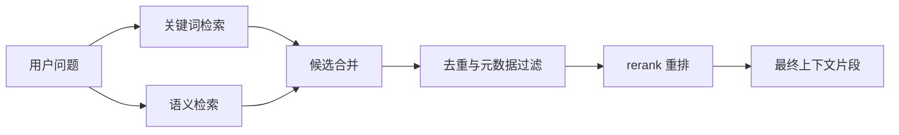

## 核心知识点
### 1. 关键词检索擅长精确，语义检索擅长变体

稀疏检索通常依赖关键词或倒排索引，适合错误码、订单号、接口名、字段名。密集检索依赖 embedding，适合自然语言表达变化。

用户问“退款多久到账”时，语义检索能匹配“退款到账时效”；用户问“ERR_LOGIN_403”时，关键词检索通常更可靠，因为错误码不能被语义猜测。

基础做法是两路召回：关键词拿精确命中，向量拿语义相似，再合并去重。不同业务可以调整两路权重。

**放到真实场景里：**代码库助手里，组件名、方法名、错误码要靠关键词；“如何禁用按钮”这种自然语言问题更适合向量。

**容易踩的坑：**不要因为向量检索听起来更先进就放弃关键词。企业知识里有大量专有名词和编号。

### 2. 混合检索是为了降低单一路线的盲区

混合检索把关键词和语义检索结合起来，让系统既能抓住精确词，又能理解不同问法。

单靠关键词会漏掉同义表达，单靠向量会误伤专有名词。混合检索的目标不是复杂，而是让召回更稳。

可以先分别取两路 top_k，再合并、去重、按分数归一化或规则加权，最后交给重排模型或规则排序。

**放到真实场景里：**测试用例生成里，“验证码错误不计入密码错误次数”可能同时需要关键词“验证码”和语义“错误次数统计规则”。

**容易踩的坑：**合并候选不是简单拼列表。重复片段、旧版本、权限不符都要先处理。

### 3. 重排让候选结果从“可能相关”变成“更该使用”

rerank 是对初次召回的候选片段做二次排序。初次检索常常追求多找一点，重排则更关注当前问题到底需要哪几段。

向量检索的 top 结果不一定最适合生成。重排模型可以同时看问题和候选文本，判断哪段更直接回答问题。

常见链路是先召回 20-50 个候选，再重排取前 5-8 个进入上下文。这样既避免漏召回，也控制最终上下文噪声。

**放到真实场景里：**用户问“登录失败多久会锁定”，候选里可能有登录页说明、密码规则、账号冻结规则。重排应该把直接讲锁定条件的片段排前面。

**容易踩的坑：**top_k 开很大不等于更好。太多候选会增加成本，也可能让重排和上下文组装压力变大。

## 一个更稳的企业检索链路长什么样

企业检索通常不是单步完成，而是先过滤可见范围，再做多路召回，然后去重、重排、截断。每一步都在减少错误资料进入上下文的概率。

| 步骤 | 它解决什么 | 常见检查 |
| --- | --- | --- |
| 权限/版本过滤 | 先排除不能用的资料 | 用户角色、业务域、版本 |
| 关键词召回 | 抓住错误码、字段名、专有名词 | BM25 或倒排索引 |
| 向量召回 | 理解自然语言变体 | embedding 相似度 |
| 候选去重 | 减少重复片段挤占上下文 | source + chunk_path |
| 重排 | 挑出最能回答当前问题的片段 | cross-encoder 或 LLM rerank |

### 先召回，再挑选，不要一步到位

初次召回可以稍微宽一点，给正确资料进入候选的机会；最终进入上下文要收紧，只留下最能支撑答案的片段。

### 检索链路也要有日志

记录每一路召回了什么、分数是多少、为什么被过滤或重排。没有日志，检索优化会变成猜谜。

#### 混合检索 + 重排伪代码

```js
async function retrieve(question, user) {
  const filter = buildPermissionFilter(user);
  const keywordHits = await keyword.search(question, { filter, topK: 20 });
  const vectorHits = await vector.search(await embed(question), { filter, topK: 20 });
  const merged = dedupe([...keywordHits, ...vectorHits]);
  return reranker.rank(question, merged).then(items => items.slice(0, 8));
}
```

**Takeaway：**检索链路的目标不是返回最多资料，而是让正确、可用、足够支撑答案的资料排在前面。

## 常见误区
- 向量检索不能替代所有关键词检索。
- top_k 越大不等于越好，它会带来噪声和成本。
- rerank 不是魔法，候选里没有正确资料时它也救不了。
- 检索阶段就要做权限过滤。

## 检索这章，核心是别赌单一路线

关键词、向量、过滤、重排各自解决不同问题。企业 RAG 更像一个分层筛选系统：先保证资料可用，再扩大召回，最后精挑细选。

- 关键词适合精确项，向量适合同义问法。
- 混合检索降低盲区。
- 重排把候选从“像”排成“更能回答”。

下一章会继续往前看：用户的问题本身也需要处理。很多时候检索不准，不是资料不行，而是问题没有被构造成适合检索的形状。

## 快速自测
1. 错误码更适合优先用什么检索？
   - A. 关键词检索
   - B. 随机检索
   - C. 图片检索
   - 答案：关键词检索

2. rerank 的作用是什么？
   - A. 二次排序
   - B. 删除权限
   - C. 训练模型
   - 答案：二次排序

3. 混合检索结合了什么？
   - A. 关键词和语义
   - B. 字体和颜色
   - C. 登录和注册
   - 答案：关键词和语义

4. top_k 太大可能带来什么？
   - A. 噪声增加
   - B. 事实变新
   - C. 权限消失
   - 答案：噪声增加

## 练一下

为“代码库助手”设计一条检索链路：哪些问题走关键词，哪些问题走向量，怎样合并候选，什么时候重排，记录哪些日志。

## 主要参考
- [Datawhale RAG 混合检索](https://github.com/datawhalechina/all-in-rag/blob/main/docs/chapter4/11_hybrid_search.md)
- [Datawhale RAG 检索进阶](https://github.com/datawhalechina/all-in-rag/blob/main/docs/chapter4/15_advanced_retrieval_techniques.md)
- [RAG 优化方案与实践](https://zhuanlan.zhihu.com/p/703182970)


---

# 7. 查询构建：把用户的话翻译成系统能执行的检索计划

> 模块：检索技术进阶  
> 建议学习时间：60 分钟

用户不会按知识库结构提问。他可能说：“帮我生成登录异常测试用例，按我们现在的模板来。”这句话里混着业务域、任务类型、资料类型、输出格式。查询构建就是把一句自然语言拆成系统能执行的检索计划。

## 本章目标
- 能解释查询构建解决的问题。
- 能把自然语言问题拆成关键词、过滤器和检索意图。
- 能理解路由、多数据源和 Text2SQL 的适用边界。
- 能设计一个简单查询计划。

## 本章图解
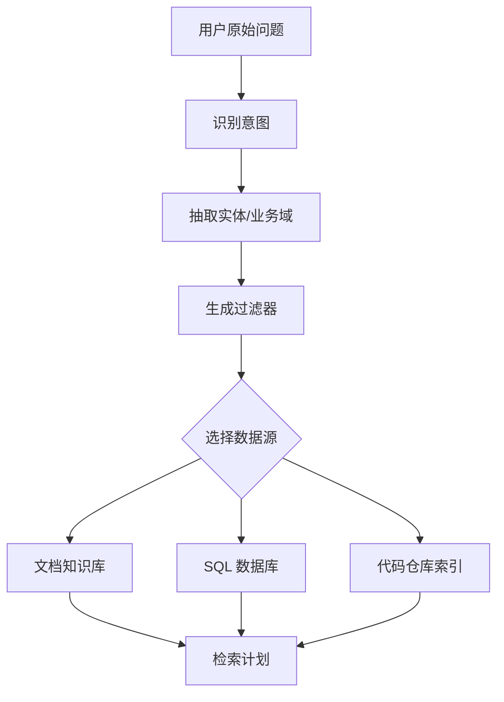

## 核心知识点
### 1. 用户问题里常常藏着过滤条件

“登录模块”“2026Q1”“客服内部”“测试用例模板”这些词，不只是普通关键词，也可能是业务域、版本、权限和文档类型。

如果系统把所有词都当语义检索文本，会在全库里盲找。查询构建会把其中一部分提取成过滤器，先缩小范围，再检索。

常见字段包括 domain、version、doc_type、audience、permission、product、language。提取后生成结构化查询计划，例如 domain=login，doc_type in [prd,test_case]。

**放到真实场景里：**用户问“按最新客服政策回答会员退款”，系统应该识别 latest、客服政策、会员退款，而不是只拿整句话做向量。

**容易踩的坑：**过滤器太强也会漏召回。比如版本识别错了，正确资料会被提前排除，所以关键过滤条件要可回退。

### 2. 路由决定问题应该去哪类知识源

企业 RAG 往往不止一个知识库：文档、数据库、代码仓库、工单系统、指标平台都可能是知识源。

不同问题适合不同检索方式。问制度条款，走文档；问订单数量，走数据库；问组件用法，走代码仓库；问历史缺陷，走工单或测试平台。

可以先做意图分类：知识问答、数据查询、代码解释、用例生成、排障。再把问题路由到对应 retriever 或工具。

**放到真实场景里：**“上周退款订单有多少”不适合只查政策文档，它更像数据库问题；“退款规则是什么”才是文档 RAG。

**容易踩的坑：**不要把所有问题都塞给同一个向量库。数据源错了，再好的检索也找不到答案。

### 3. Text2SQL 适合结构化数据，不适合替代文档问答

Text2SQL 是把自然语言转成 SQL 查询，适合查表格数据、指标、订单、库存、日志聚合。

它解决的是结构化数据查询，不是让模型读制度文档。Text2SQL 需要表结构、字段含义、权限和安全限制，否则容易生成危险或错误 SQL。

一个安全流程会先选择允许访问的表，提供字段说明和样例，再生成 SQL，校验只读和权限，最后执行并解释结果。

**放到真实场景里：**用户问“过去 7 天退款订单按原因分布”，Text2SQL 合适；用户问“退款规则有哪些例外”，文档 RAG 合适。

**容易踩的坑：**不要让模型直接对生产库自由写 SQL。必须有白名单、只读限制、超时、行数限制和审计。

## 从一句话拆出一份检索计划

查询构建的产物不一定给用户看，但系统应该能记录它。比如用户说“基于 2026Q1 登录 PRD 和历史缺陷，生成后台登录异常测试用例”，这里至少包含任务、业务域、版本、数据源、文档类型和输出意图。

| 原始表达 | 结构化含义 | 检索影响 |
| --- | --- | --- |
| 生成测试用例 | task=test_case_generation | 需要 PRD、规则、历史用例模板 |
| 后台登录 | domain=login, product=admin | 过滤业务域和产品端 |
| 2026Q1 | version=2026Q1 | 优先最新版本 |
| 历史缺陷 | doc_type=bug | 召回缺陷经验物料 |
| 异常 | scenario=negative | 重点找边界和错误流程 |

### 查询计划要能解释，而不是黑箱

当检索结果不对时，先看查询计划：是否识别错业务域，是否漏了文档类型，是否过滤太窄。可解释的计划让调试快很多。

### 允许回退，别把用户问题一次判死

如果强过滤没有结果，可以降级到宽过滤；如果路由不确定，可以并行查两个数据源。企业问题常常不干净，系统也要留弹性。

#### 查询计划对象示例

```js
const queryPlan = {
  task: "test_case_generation",
  intent: "retrieve_requirements_and_defects",
  filters: {
    domain: "login",
    product: "admin",
    version: "2026Q1",
    docType: ["prd", "bug", "test_case_template"]
  },
  retrievers: ["document", "issue_tracker"]
};
```

#### 查询计划对象示例

```java
record QueryPlan(
  String task,
  Map<String, Object> filters,
  List<String> retrievers
) {}
```

**Takeaway：**查询构建把一句自然语言翻译成可执行、可解释、可回退的检索计划。

## 常见误区
- 查询构建不是把问题改写得更长，而是提取可执行条件。
- Text2SQL 不适合所有问题，它主要查结构化数据。
- 路由判断错了，检索会从源头跑偏。
- 过滤越多不一定越好，太窄会漏召回。

## 问题也需要被整理

前几章我们整理资料，这一章开始整理用户问题。好的查询构建能把自然语言里的业务域、版本、权限、任务类型翻译成检索计划，让系统少在错误资料里绕路。

- 从问题里抽取过滤条件。
- 按意图路由到文档、数据库、代码或工单。
- Text2SQL 只适合结构化数据查询，并且必须受控。

下一章继续处理用户问题，但会更进一步：当用户问得模糊、太短或需要多步推理时，系统要学会改写、拆解和多跳检索。

## 快速自测
1. 查询构建主要产出什么？
   - A. 检索计划
   - B. 页面皮肤
   - C. 登录按钮
   - 答案：检索计划

2. Text2SQL 适合查询什么？
   - A. 结构化数据
   - B. 任意图片
   - C. 模型参数
   - 答案：结构化数据

3. 路由的作用是什么？
   - A. 选择数据源
   - B. 隐藏答案
   - C. 压缩字体
   - 答案：选择数据源

4. 过滤器太强可能导致什么？
   - A. 漏召回
   - B. 权限变好
   - C. 成本归零
   - 答案：漏召回

## 练一下

写 5 个用户问题，并把每个问题拆成 task、filters、retrievers、fallback 四部分。至少包含一个文档问答、一个数据查询、一个代码库问题。

## 主要参考
- [Datawhale RAG 查询构建](https://github.com/datawhalechina/all-in-rag/blob/main/docs/chapter4/12_query_construction.md)
- [Datawhale RAG 文本到 SQL](https://github.com/datawhalechina/all-in-rag/blob/main/docs/chapter4/13_text2sql.md)
- [LangChain RAG 教程](https://docs.langchain.com/oss/python/langchain/rag)


---

# 8. 查询重写与进阶检索：让系统会追问、会拆题、会多跳查资料

> 模块：检索技术进阶  
> 建议学习时间：60 分钟

不是每个用户问题都清楚。有人只问“这个怎么测”，有人把多个问题塞在一句话里，有人用口语说“它会不会锁住”。查询重写和进阶检索的作用，就是在检索前先把问题变得更可查，必要时分多步查。

## 本章目标
- 能解释查询重写的用途。
- 能区分扩写、拆解、HyDE、多查询和多跳检索。
- 能理解 agentic RAG 的基本思路。
- 能判断什么时候不该过度改写。

## 本章图解
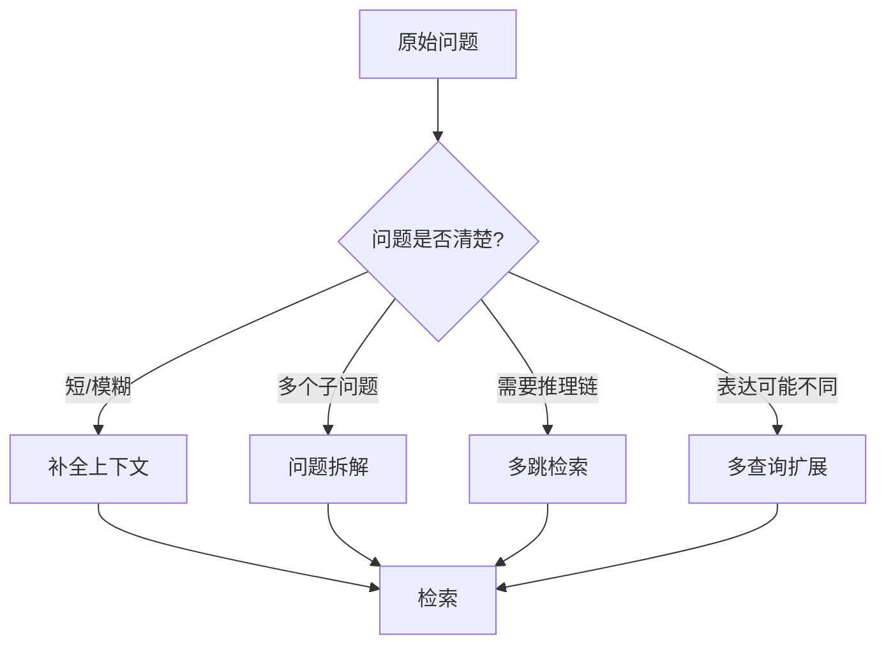

## 核心知识点
### 1. 查询重写是为了更好检索，不是为了改写文案

查询重写会把用户原始问题改成更适合检索的表达。它可以补全省略、统一术语、拆分子问题，也可以生成多个等价问法。

用户说“这个怎么测”，如果上一轮聊的是登录锁定规则，系统应该把“这个”补成“登录密码错误锁定规则”。否则直接检索“这个怎么测”几乎没有意义。

常见方式包括：上下文补全、关键词扩展、同义改写、问题拆解、多查询并发、假设性答案生成。每种方式都要记录原问题和改写后问题。

**放到真实场景里：**测试同学问“边界条件还有哪些”，系统可以改写为“登录模块密码错误次数、验证码错误、账号锁定时长的边界条件”。

**容易踩的坑：**改写不能改变用户意图。把“登录失败”改成“支付失败”，检索再努力也错了。

### 2. 多查询适合表达不确定，问题拆解适合任务复杂

多查询是生成多个检索表达，覆盖不同说法；问题拆解是把一个复杂问题拆成多个子问题，分别查资料。

如果用户问法可能和资料写法不同，多查询有用；如果用户要求生成测试用例、覆盖异常和历史缺陷，就需要拆成规则、接口、缺陷、模板几个子问题。

多查询通常并行检索后合并去重；问题拆解则要保留子问题和最终任务的关系，避免各查各的后无法合成。

**放到真实场景里：**“退款多久到账”可以扩展为“退款时效、到账时间、退钱几天”；“生成登录测试用例”要拆成规则、字段、异常、历史缺陷、模板。

**容易踩的坑：**不要把所有问题都扩成一堆查询。查询越多，成本越高，噪声也越多。

### 3. 多跳检索适合答案需要沿着线索追下去

多跳检索不是一次找完，而是先找第一批资料，再基于中间结果继续检索。

有些问题需要跨文档连接。例如“这个历史缺陷对应的规则现在是否还有效”，系统要先找到缺陷，再找到关联规则和当前版本说明。

多跳流程一般是：检索初始线索，抽取实体或引用，生成下一跳查询，再检索补充资料，最后合成答案并列出证据链。

**放到真实场景里：**代码库助手回答“这个组件为什么不推荐继续用”，可能要先查组件说明，再查迁移指南，最后查历史 issue。

**容易踩的坑：**多跳检索容易引入错误链条。第一跳错了，后面会越走越偏，所以每跳都要保留证据和停止条件。

## 生成测试用例时，查询重写应该怎么做

“帮我生成登录异常测试用例”不是一个简单检索问题。系统需要找到规则、接口字段、异常流程、历史缺陷和用例格式。更好的做法是先拆任务，再分别检索。

| 子问题 | 检索资料 | 输出作用 |
| --- | --- | --- |
| 登录有哪些核心规则？ | PRD / 业务规则 | 决定正常路径和边界 |
| 有哪些异常提示？ | 异常流程 / 页面文案 | 决定负向用例 |
| 接口有哪些字段和错误码？ | 接口文档 | 决定参数组合 |
| 历史上出过什么问题？ | 缺陷记录 | 补充回归场景 |
| 用例格式是什么？ | 历史用例模板 | 保证结果可接收 |

### 重写后的问题要服务最终任务

不是把问题变得华丽，而是让每个子查询都能拿回一类必要证据。最后合成答案时，也要标明每类用例来自哪些资料。

### 拆题后更要防止资料打架

不同子查询可能召回不同版本资料。合成前要按版本、状态和权限统一，否则答案会把旧缺陷和新规则混在一起。

#### 任务拆解式检索

```js
const subQueries = [
  "登录模块业务规则 2026Q1",
  "登录异常流程 错误提示",
  "登录接口字段 错误码",
  "登录历史缺陷 回归场景",
  "测试用例模板 前置条件 步骤 预期结果"
];

const evidence = await Promise.all(subQueries.map(q => retrieve(q, user)));
```

**Takeaway：**进阶检索的关键不是“查得更多”，而是围绕任务有计划地查。

## 常见误区
- 查询重写不是随意扩写，不能改变用户意图。
- 多查询会增加噪声，需要合并去重和评测。
- 多跳检索适合复杂问题，不适合每个简单问答。
- Agentic RAG 也需要边界和停止条件。

## 让系统先想清楚怎么问

第八章把检索前的智能补上了：问题短，就补全；问题复杂，就拆解；表达可能不同，就多查询；需要沿线索查，就多跳。它们都服务同一个目标：让正确资料更有机会进入候选。

- 重写服务检索，不服务文采。
- 拆题适合复杂任务，多查询适合表达差异。
- 多跳检索要保留证据链和停止条件。

资料找到了，下一章要进入生成阶段：怎么把资料交给模型，既回答得像人话，又不乱编、不乱引。

## 快速自测
1. 查询重写不能改变什么？
   - A. 用户意图
   - B. 页面颜色
   - C. 文件大小
   - 答案：用户意图

2. 多查询主要覆盖什么？
   - A. 不同表达
   - B. 不同字体
   - C. 不同账号
   - 答案：不同表达

3. 多跳检索每一步都要保留什么？
   - A. 证据链
   - B. 动画
   - C. 随机数
   - 答案：证据链

4. 复杂用例生成更适合先做什么？
   - A. 任务拆解
   - B. 直接回答
   - C. 删除资料
   - 答案：任务拆解

## 练一下

把“帮我生成登录模块异常测试用例”拆成 5 个子查询，并为每个子查询写出需要检索的资料类型和最终会影响哪类用例。

## 主要参考
- [Datawhale RAG 查询重构与分发](https://github.com/datawhalechina/all-in-rag/blob/main/docs/chapter4/14_query_rewriting.md)
- [Datawhale RAG 检索进阶](https://github.com/datawhalechina/all-in-rag/blob/main/docs/chapter4/15_advanced_retrieval_techniques.md)
- [RAG 18 种常见算法对比](https://blog.csdn.net/l01011_/article/details/149039999)


---

# 9. 生成阶段：上下文组装、引用、拒答与结构化输出

> 模块：生成集成与评估  
> 建议学习时间：60 分钟

检索到了资料，不代表答案自然就会好。生成阶段像把食材交给厨师：食材要新鲜，菜单要明确，禁忌也要写清楚。RAG 的生成不是让模型自由聊天，而是让模型在给定上下文、引用规则和输出格式里完成任务。

## 本章目标
- 能解释上下文包包含哪些内容。
- 能设计带引用的 RAG 回答规则。
- 能理解拒答和资料不足提示。
- 能使用结构化输出约束答案格式。

## 本章图解
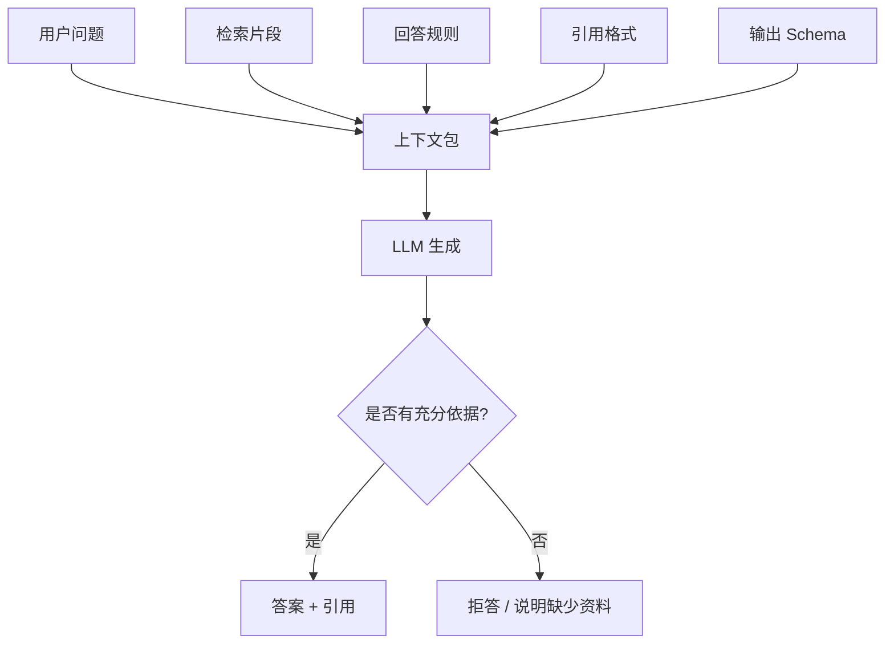

## 核心知识点
### 1. 上下文包不是把片段拼起来那么简单

上下文包通常包含用户问题、检索片段、片段来源、回答规则、引用要求、输出格式和安全边界。

如果只把候选片段拼在一起，模型可能不知道哪个片段更权威、哪些资料冲突、什么时候应该拒答。上下文包要把“如何使用资料”讲清楚。

可以按固定结构组装：任务说明、用户问题、可用资料列表、回答规则、引用规则、输出格式。资料列表里每段都带 id、title、source、version。

**放到真实场景里：**生成测试用例时，上下文包不仅要给规则，还要给用例模板。否则模型可能懂业务，却输出测试同学不愿意接收的格式。

**容易踩的坑：**上下文越长不一定越好。无关片段越多，模型越容易分心。

### 2. 引用让答案可核验，但引用也要被约束

引用不是在答案末尾随便贴几个链接，而是每个关键结论都能对应到支持它的资料。

企业场景里，用户需要知道答案从哪里来。客服要核对政策，测试要核对 PRD，研发要核对代码规范。引用质量决定系统是否可信。

让模型只引用提供的 source id；要求每条结论后标注引用；如果多个资料冲突，优先新版或权威来源，并说明冲突。

**放到真实场景里：**回答“连续几次密码错误会锁定”时，答案后应该引用登录规则物料，而不是引用整个 PRD 首页。

**容易踩的坑：**模型可能伪造引用。系统应该校验引用 id 是否来自本次检索结果。

### 3. 拒答是企业 RAG 的重要能力

资料不足时，好的 RAG 不应该硬编。它应该说明缺少什么资料，并给出下一步建议。

拒答不是失败，而是防止错误答案进入业务流程。尤其是政策、法务、安全、代码变更这些场景，乱答比不答更危险。

在提示词里定义拒答条件：上下文没有依据、资料版本冲突、用户无权限、问题超出知识库范围。拒答时输出缺口，而不是只说“不知道”。

**放到真实场景里：**用户问未发布功能的赔付规则，如果知识库没有正式制度，系统应该提示“未找到已生效规则”，而不是根据历史草稿猜。

**容易踩的坑：**不要把拒答写得太保守。资料足够时也拒答，会让系统不可用。拒答规则需要评测集调校。

### 4. 结构化输出让答案能进入下游流程

很多企业 RAG 不只是回答一句话，还要生成表格、测试用例、JSON、工单摘要。结构化输出能让结果更容易被系统接收。

自然语言适合阅读，结构化数据适合自动处理。比如测试用例应该有标题、前置条件、步骤、预期结果、优先级、引用来源。

先定义输出字段，再让模型按 Schema 生成；生成后做字段校验、引用校验和空值检查。必要时让模型修复格式，但不要让它修改事实依据。

**放到真实场景里：**业务测试用例生成可以输出数组，每条包含 case_title、precondition、steps、expected_result、priority、source_ids。

**容易踩的坑：**结构化输出不等于事实正确。格式对了，还要检查引用和覆盖率。

## 一个企业可用的回答规则应该写清楚什么

RAG 的提示词不是越长越好，而是要把边界写清楚：只能基于上下文回答、每个关键结论要引用、资料不足要拒答、冲突时按版本优先、输出格式必须稳定。

| 规则 | 目的 | 错误时的表现 |
| --- | --- | --- |
| 只基于上下文 | 减少幻觉 | 模型编造企业不存在的规则 |
| 关键结论带引用 | 方便核验 | 用户不知道依据来自哪里 |
| 资料不足要说明 | 避免硬编 | 无依据也给肯定答案 |
| 冲突按权威和版本处理 | 降低旧资料污染 | 新旧规则混用 |
| 结构化输出 | 接入下游流程 | 结果无法被系统消费 |

### 提示词是合同，不是装饰

它规定模型在这次任务中的权利和边界。尤其在企业系统里，模型能不能引用、能不能猜、输出什么字段，都要明说。

### 引用校验最好放在程序里

不要完全相信模型声称的引用。程序可以检查 source_id 是否来自本次检索，引用片段是否真的支持对应结论。

#### 结构化测试用例输出示例

```js
const schema = {
  caseTitle: "string",
  precondition: "string",
  steps: ["string"],
  expectedResult: "string",
  priority: "P0 | P1 | P2",
  sourceIds: ["string"]
};
```

#### 结构化测试用例输出示例

```java
record TestCase(
  String caseTitle,
  String precondition,
  List<String> steps,
  String expectedResult,
  String priority,
  List<String> sourceIds
) {}
```

**Takeaway：**生成阶段的目标不是让模型说得漂亮，而是让答案有依据、可核验、格式稳定、能进入业务流程。

## 常见误区
- 检索到资料不代表生成一定正确。
- 引用必须可校验，不能只靠模型自觉。
- 拒答不是失败，而是安全边界。
- 结构化输出只保证格式，不保证事实。

## 把模型关进一间有资料的房间

第九章讲的是生成边界：给模型资料，也给它规则。它该引用什么、不能猜什么、资料不足怎么说、结果按什么格式输出，都要提前设计。

- 上下文包包含问题、资料、引用、规则和格式。
- 关键结论要有可校验引用。
- 资料不足时要拒答或说明缺口。
- 结构化输出服务下游流程。

下一章我们会反过来看系统质量：答案到底有没有变好，不能靠感觉，要靠评测和可观测性。

## 快速自测
1. 上下文包不应只包含什么？
   - A. 片段拼接
   - B. 引用规则
   - C. 输出格式
   - 答案：片段拼接

2. 资料不足时系统应该怎样？
   - A. 说明缺口
   - B. 硬编答案
   - C. 伪造引用
   - 答案：说明缺口

3. 引用 id 最好由谁校验？
   - A. 程序校验
   - B. 随机猜测
   - C. 页面动画
   - 答案：程序校验

4. 结构化输出主要帮助什么？
   - A. 系统消费
   - B. 减少来源
   - C. 删除权限
   - 答案：系统消费

## 练一下

为“客诉答疑”写一份 RAG 回答规则：包含引用规则、拒答规则、冲突处理、输出字段和引用校验要求。

## 主要参考
- [Datawhale RAG 格式化生成](https://github.com/datawhalechina/all-in-rag/blob/main/docs/chapter5/16_formatted_generation.md)
- [OpenAI Retrieval 文档](https://developers.openai.com/api/docs/guides/retrieval)
- [内部 PDF：RAG 方案对比](../../../assets/RAG%20方案对比.pdf)


---

# 10. 评测与可观测性：不要凭感觉优化 RAG

> 模块：生成集成与评估  
> 建议学习时间：60 分钟

RAG 系统最容易陷入一种假进步：改了一个参数，挑几个问题试试，感觉好像更准了。企业系统不能靠感觉上线。评测和可观测性的作用，就是把“我觉得好”变成“在哪类问题上、因为什么变好或变差”。

## 本章目标
- 能解释为什么 RAG 必须有评测集。
- 能区分检索指标、生成指标和业务指标。
- 能设计一条 RAG 请求日志。
- 能用错误分类指导优化。

## 本章图解
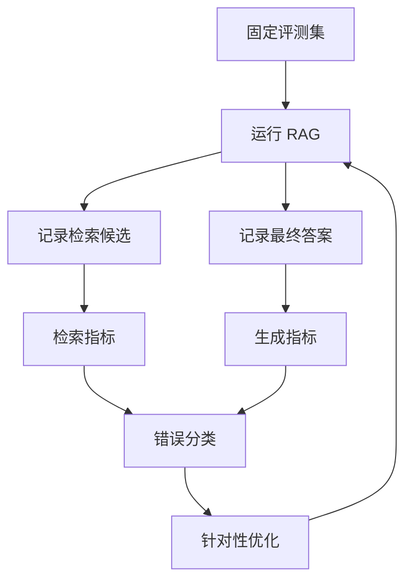

## 核心知识点
### 1. 评测集让优化有同一把尺

评测集 是一组固定问题、期望答案、期望引用和评分规则。没有评测集，每次改动都像换题考试，无法比较。

RAG 优化常常有副作用：chunk 变大可能提升某些综合问题，却降低精确引用；top_k 增大可能提高召回，却引入噪声。固定评测集能看出取舍。

从真实业务问题开始收集：高频问题、容易错的问题、权限敏感问题、跨文档问题、拒答问题。每题写出标准答案或评分标准，以及应该引用哪些资料。

**放到真实场景里：**客诉答疑可以准备 50 个问题：退款、赔付、物流、特殊商品、超范围问题、旧规则干扰问题。

**容易踩的坑：**不要只放简单题。评测集太简单，系统会在演示中很好看，上线后很脆。

### 2. 检索指标和生成指标要分开看

答案错了，不一定是模型生成错。可能是正确资料没召回，也可能召回了但没放进上下文，还可能放进去了但模型没用。

检索指标看正确资料是否进入候选、排名是否靠前；生成指标看答案是否忠实、引用是否支撑结论、格式是否合规。

常见检索指标包括 hit@k、MRR、召回来源覆盖；生成指标包括 faithfulness、answer correctness、citation quality、format validity。

**放到真实场景里：**如果正确资料没有进 top 20，先修检索；如果进了 top 5 但答案没引用，修上下文和提示词；如果答案格式不对，修结构化输出。

**容易踩的坑：**不要用一个总分掩盖问题。总分下降 2 分，可能来自完全不同的根因。

### 3. 可观测性让每次回答都能回放

可观测性 是记录一次请求的输入、检索、重排、上下文、生成、引用、成本、耗时和用户反馈。

上线后用户报错时，你需要重放当时系统看到了什么资料、为什么选了这些片段、模型生成了什么、引用来自哪里。

日志至少记录 query、query_plan、retrieved_chunks、reranked_chunks、context_ids、answer、citations、latency、cost、model、error_type。

**放到真实场景里：**测试同学说“漏了验证码错误场景”，你可以查日志确认是资料没召回、被重排挤掉，还是生成时没覆盖。

**容易踩的坑：**不要只记录最终答案。最终答案无法帮助定位检索链路的问题。

## 错误分类比盲目调参更有用

RAG 错误通常可以分成资料缺失、解析清洗错误、分块错误、检索漏召回、重排排序错、上下文过长、生成不忠实、引用错误、权限错误。分类之后，优化才有方向。

| 错误类型 | 症状 | 优先修哪里 |
| --- | --- | --- |
| 资料缺失 | 知识库根本没有依据 | 补资料和数据血缘 |
| 分块错误 | 答案跨块断裂 | 调整 chunk 边界 |
| 检索漏召回 | 正确资料没进候选 | 混合检索/查询重写 |
| 重排错误 | 正确资料候选中但排名低 | rerank 和特征 |
| 生成不忠实 | 资料在上下文里但答案乱说 | 提示词/引用校验 |
| 权限错误 | 召回不可见资料 | 检索阶段权限过滤 |

### 先定位，再优化

很多团队一出错就调 prompt 或换模型，但如果正确资料没有召回，换再好的模型也只是更流畅地猜。错误分类能防止你修错层。

### 评测要包含回归

每次修复一个错误，都把它加入评测集。否则下次优化别的地方时，很可能把旧问题重新改坏。

#### 评测样例结构

```js
const evalCase = {
  question: "验证码错误是否计入密码错误次数？",
  expectedAnswer: "不计入。",
  expectedSources: ["login-rule-2026q1#captcha"],
  checks: ["retrieval_hit", "faithfulness", "citation_quality"]
};
```

**Takeaway：**RAG 优化不是玄学调参，而是基于日志和评测集的错误定位。

## 常见误区
- 只看最终答案无法定位问题。
- 评测集不能只放简单题和成功样例。
- 换模型不一定能解决检索错误。
- 用户反馈要进入评测回归，而不是只看一次。

## 从“感觉不错”走到“证据不错”

第十章是工程分水岭。没有评测和日志，RAG 只是一个会聊天的演示；有了评测和可观测性，它才开始像一个可以迭代的系统。

- 评测集提供固定尺子。
- 检索指标和生成指标要分开看。
- 请求日志要能回放每次回答。
- 错误分类决定优化顺序。

下一章会把前面所有组件合到企业架构里，看一个知识库从数据、服务、权限到发布到底怎么设计。

## 快速自测
1. 评测集的作用是什么？
   - A. 固定尺子
   - B. 美化页面
   - C. 删除引用
   - 答案：固定尺子

2. 正确资料没召回应先修什么？
   - A. 检索链路
   - B. 按钮颜色
   - C. 头像尺寸
   - 答案：检索链路

3. 可观测性不只记录什么？
   - A. 最终答案
   - B. 检索候选
   - C. 模型耗时
   - 答案：最终答案

4. 错误分类的价值是什么？
   - A. 定位优化方向
   - B. 替代资料
   - C. 隐藏问题
   - 答案：定位优化方向

## 练一下

为“客诉答疑 RAG”设计 10 条评测题，覆盖高频问题、旧版政策干扰、权限问题、拒答问题，并写出每题期望引用。

## 主要参考
- [Datawhale RAG 系统评估](https://github.com/datawhalechina/all-in-rag/blob/main/docs/chapter6/18_system_evaluation.md)
- [Datawhale RAG 评估工具](https://github.com/datawhalechina/all-in-rag/blob/main/docs/chapter6/19_common_tools.md)
- [内部 PDF：关于 RAG 优化的思考记录](../../../assets/关于%20RAG%20优化的思考记录.pdf)


---

# 11. 企业级 RAG 架构：权限、更新、服务化与安全边界

> 模块：企业项目实战  
> 建议学习时间：60 分钟

到这里，我们已经学过数据、分块、向量、检索、生成和评测。第十一章把它们拼成一个企业系统。注意，这不是把所有高级词堆在一起，而是回答一个朴素问题：如果明天要给团队上线一个知识库，哪些模块不能少，哪些可以后补？

## 本章目标
- 能画出企业知识库的端到端架构。
- 能说明权限、版本、审计、更新在架构中的位置。
- 能理解 GraphRAG、Workflow RAG、Agentic RAG 的适用场景。
- 能设计一个企业 RAG MVP 的服务边界。

## 本章图解
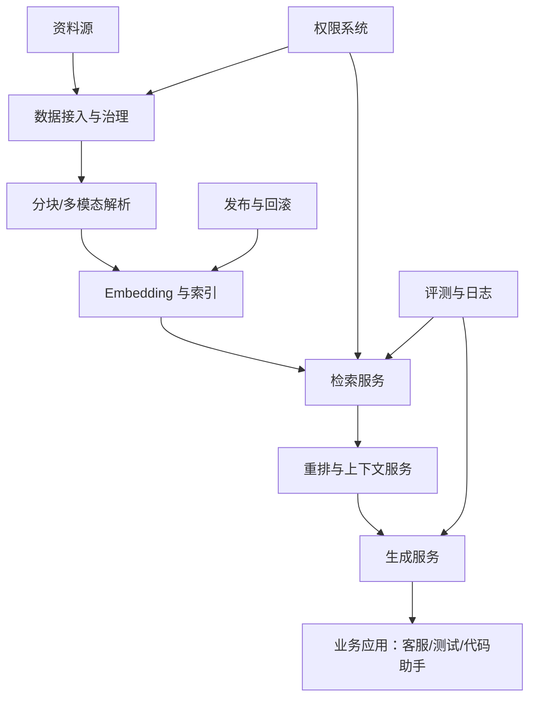

## 核心知识点
### 1. 企业 RAG 要把离线链路和在线链路分开

离线链路负责资料治理、分块、嵌入、索引；在线链路负责接收问题、检索、重排、生成、记录日志。

两条链路的节奏不同。资料更新可以批处理、审核、发布；用户问答需要低延迟、可用性和权限控制。混在一起会让系统难维护。

把数据管道、索引服务、检索服务、生成服务、评测服务拆成边界清晰的模块。MVP 可以部署简单，但逻辑边界要清楚。

**放到真实场景里：**客服政策每天更新一次，离线链路夜间重建索引；在线客服问答白天稳定服务，并能回滚到上一版索引。

**容易踩的坑：**不要让用户查询触发随意入库和重建索引。在线链路要稳定，数据更新要可审核。

### 2. 权限和审计必须进入核心链路

企业知识库里的资料不是人人可见。权限不是 UI 功能，而是检索和生成的基础约束。

如果不可见资料进入候选片段，即使最终答案没有直接引用，也可能影响模型生成。审计则保证出了问题能追到人、资料和版本。

权限字段在入库时写入元数据，检索时按用户身份过滤，上下文组装时再次校验，日志记录用户、资料、答案和引用。

**放到真实场景里：**内部客服手册可以给客服坐席看，但不能给普通用户看；研发代码规范可以给内部工程师看，但不能进入公开问答。

**容易踩的坑：**不要等答案生成后再脱敏。模型已经看过不可见资料，风险就已经发生。

### 3. 企业 RAG 需要发布、回滚和版本治理

知识库不是一次性上传完就结束。资料会更新，索引会重建，评测会发现回归，业务也会要求回滚。

没有版本治理，今天的知识库和昨天有什么差异没人知道；答案变差也无法回到上一版。企业系统必须把知识库当成可发布的软件资产。

每次发布记录资料批次、清洗规则、分块参数、embedding 模型、索引版本、评测结果。上线后监控反馈，必要时回滚索引版本。

**放到真实场景里：**新赔付规则上线后，评测发现特殊商品例外条款召回失败，可以先回滚索引，再修复分块和元数据。

**容易踩的坑：**不要只版本化原始文件。清洗规则、分块参数和 embedding 模型同样影响结果。

### 4. GraphRAG 和 Agentic RAG 是进阶选项，不是 MVP 必需品

GraphRAG 用实体和关系组织知识，适合跨文档关系问题；Agentic RAG 让系统能规划多步检索和工具调用。

它们解决的是复杂推理、关系追踪、多源协作，不是所有知识库第一天都要上。MVP 先把资料、检索、引用、评测跑稳，再逐步引入。

当问题经常涉及“某客户、某产品、某缺陷、某版本之间的关系”时，可以考虑知识图谱；当问题需要查文档、查数据库、查代码多步协作时，可以考虑 Agentic RAG。

**放到真实场景里：**客户成功系统要回答“这个客户过去三个月的投诉、补偿和合同条款有什么关系”，GraphRAG 可能有价值。

**容易踩的坑：**不要用高级架构掩盖基础数据治理不足。脏数据上建图，只会得到更复杂的脏结果。

## 一个企业 RAG MVP 应该先保住哪些能力

第一版不需要把所有高级功能做满，但必须保住业务可信度。最低要求是：资料可控、权限可控、答案可引用、错误可复盘、版本可回滚。

| 能力 | MVP 做到什么 | 后续增强 |
| --- | --- | --- |
| 资料治理 | 来源、版本、权限、抽检 | 自动质量评分和血缘图 |
| 检索 | 混合检索 + 重排 | 多跳、Agentic、GraphRAG |
| 生成 | 引用、拒答、结构化输出 | 多模板、多角色答案 |
| 评测 | 固定评测集 + 请求日志 | 自动回归和线上 A/B |
| 发布 | 索引版本和回滚 | 灰度、审批流、变更影响分析 |

### MVP 不是粗糙版，而是边界清楚版

可以先少做功能，但不能少做引用、权限和日志。否则系统看似能回答，却无法被业务信任。

### 先服务一个场景，再扩成平台

客诉答疑、测试用例生成、代码库助手三者都能做，但第一版最好选一个主场景打穿，再抽象共同能力。


**Takeaway：**企业级不是功能堆满，而是关键风险被控制住：资料、权限、引用、评测、发布。

## 常见误区
- 企业 RAG 不是把 Demo 接到生产环境就完事。
- 权限不是前端展示问题，而是检索链路问题。
- GraphRAG 和 Agentic RAG 不应替代基础治理。
- 版本化只管文件是不够的，还要管索引和参数。

## 这一章把零件装成系统

第十一章的重点是架构边界。企业 RAG 至少要分清离线数据链路和在线问答链路，并把权限、审计、评测、发布放进核心流程。

- 离线负责治理和索引，在线负责检索和生成。
- 权限过滤要发生在检索阶段。
- 知识库要像软件一样发布、评测和回滚。
- 高级 RAG 能力应建立在基础链路稳定之后。

最后一章，我们会把所有知识落到一个毕业项目：从一个业务场景出发，搭一个可以演示、可以评测、可以解释的企业知识库。

## 快速自测
1. 企业 RAG 在线链路主要负责什么？
   - A. 检索生成
   - B. 清洗文件
   - C. 购买域名
   - 答案：检索生成

2. 权限过滤应该进入哪里？
   - A. 检索阶段
   - B. 答案之后
   - C. 页面底部
   - 答案：检索阶段

3. 知识库版本不只包括文件，还包括什么？
   - A. 索引参数
   - B. 背景图片
   - C. 用户头像
   - 答案：索引参数

4. MVP 必须保住什么？
   - A. 引用和日志
   - B. 复杂动画
   - C. 社交分享
   - 答案：引用和日志

## 练一下

为“客诉答疑知识库”画一张企业 RAG MVP 架构图，标出离线链路、在线链路、权限、评测、发布和回滚位置。

## 主要参考
- [内部 PDF：RAG 方案对比](../../../assets/RAG%20方案对比.pdf)
- [内部 PDF：大模型生码的原理与 RAG 工程实践](../../../assets/大模型生码的原理与%20RAG%20工程实践.pdf)
- [Datawhale 知识图谱 RAG](https://github.com/datawhalechina/all-in-rag/blob/main/docs/chapter7/20_kg_rag.md)


---

# 12. 毕业项目：搭建一个可解释的企业知识库

> 模块：企业项目实战  
> 建议学习时间：90 分钟 + 1-2 天实践

最后一章不再新增一堆术语，而是把前面学过的东西落到项目。你要做的不是一个炫技聊天框，而是一个可解释的企业知识库：它知道资料从哪来，为什么召回这些片段，答案依据是什么，什么时候应该拒答。

## 本章目标
- 能选择一个适合 RAG 的业务场景。
- 能整理资料、设计元数据、配置检索和回答规则。
- 能建立小型评测集并做一次优化。
- 能用架构图和证据讲清自己的方案。

## 本章图解
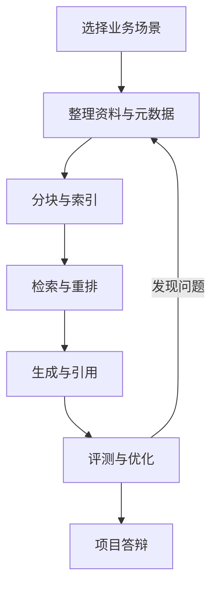

## 核心知识点
### 1. 先选一个真实、窄、可评测的场景

好项目不是范围越大越好。范围太大，资料治理和评测都会失控。第一版最好选一个明确业务场景。

适合入门的三个方向是客诉答疑、业务测试用例生成、代码库助手。它们都有明确资料源、问题类型和评测方式。

用五个问题筛选：用户是谁，资料在哪里，答案是否需要引用，错误后果是什么，能否准备 20 条评测题。

**放到真实场景里：**“公司全知识库助手”太大；“登录模块测试用例生成助手”更窄，也更容易做出效果。

**容易踩的坑：**不要先选工具。先选场景和资料，再决定用 Dify、FastGPT、AnythingLLM、LangChain 还是自研。

### 2. 项目交付要包含知识库，不只包含聊天界面

一个 RAG 项目的核心交付包括资料清单、元数据设计、分块策略、检索链路、回答规则、评测集和演示问题。

聊天界面只是入口。真正体现工程能力的是你能解释资料怎么进入系统、为什么这样切、为什么这样检索、答案如何引用、错误如何定位。

准备一份项目说明：场景、用户、资料源、架构图、关键配置、评测结果、已知限制、下一步优化。

**放到真实场景里：**测试用例生成项目应该展示：PRD、接口文档、历史缺陷、历史用例模板如何分别入库，以及生成的用例如何引用来源。

**容易踩的坑：**不要只录一段成功演示。答辩时一定会有人问：如果资料没有答案怎么办？如果旧资料冲突怎么办？

### 3. 评测和复盘决定项目是否可信

毕业项目至少要有 20 条评测题，覆盖正常问答、边界问题、拒答问题、旧资料干扰和权限问题。

没有评测，项目只能证明某几个问题答得不错；有评测，才能说明系统在哪些问题上稳定，哪些地方还需要优化。

先跑基线，再根据错误分类优化一次。记录修改前后：检索命中率、引用质量、答案正确性、格式合规率。

**放到真实场景里：**如果发现“历史缺陷”经常召回不到，就回到资料整理和检索链路，而不是直接要求模型“多想想”。

**容易踩的坑：**不要把评测结果只写成通过率。要写出典型错误和下一步计划，这才像真实工程复盘。

## 三条项目路线，选择一条打穿

课程最后推荐三条路线。它们难度不同，但都能覆盖 RAG 的核心链路。选择时不要贪多，先把一条路线做成可解释的闭环。

| 路线 | 资料源 | 核心难点 | 适合展示什么 |
| --- | --- | --- | --- |
| 客诉答疑 | 政策、FAQ、工单摘要 | 旧版规则干扰、拒答、引用 | 可追溯问答 |
| 测试用例生成 | PRD、接口、缺陷、用例模板 | 资料拆解、结构化输出 | 从知识到业务产物 |
| 代码库助手 | README、组件示例、类型定义、测试 | 代码结构、精确检索 | 研发提效场景 |

### 低代码路线也要讲清工程设计

使用 Dify、Coze、FastGPT 或 AnythingLLM 都可以，但不要只展示配置截图。要说明资料怎么治理、检索怎么配置、引用怎么验证、评测怎么做。

### 可选代码路线服务理解，不强迫炫技

如果学习者有编程基础，可以用 JavaScript 或 Java 伪代码描述服务边界；如果没有，也可以用流程图和配置表把架构讲清楚。

#### 项目说明最小目录

```js
const projectPackage = {
  scenario: "登录模块测试用例生成",
  documents: ["PRD", "接口文档", "历史缺陷", "用例模板"],
  metadata: ["source", "version", "domain", "docType", "permission"],
  evalSetSize: 20,
  outputs: ["架构图", "演示链接", "评测报告", "优化记录"]
};
```

**Takeaway：**毕业项目不是证明你会用某个工具，而是证明你能把资料、检索、生成、引用和评测组织成一个可信系统。

## 常见误区
- 项目范围越大不等于越高级。
- 低代码工具不代表不用做资料治理。
- 一次成功演示不能替代评测集。
- 毕业项目要能说明限制，而不是假装完美。

## 最后，把 RAG 讲成一个你能负责的系统

这门课从“模型凭什么知道答案”开始，到“如何搭一个可解释企业知识库”结束。你不需要一开始就成为算法专家，但要能把资料、检索、生成、评测这些环节说清楚、做出来、测一下、再优化。

- 先选窄场景，再做资料治理。
- 项目交付包含架构、资料、配置、评测和复盘。
- 引用、拒答、权限、日志是企业可信度的底座。

完成项目后，下一步可以往两个方向走：深入工程实现，或深入某个业务场景，把 RAG 和 Agent、工具调用、工作流结合起来。

## 快速自测
1. 毕业项目最好先选什么场景？
   - A. 窄且可评测
   - B. 越大越好
   - C. 完全无资料
   - 答案：窄且可评测

2. 项目交付不应只有什么？
   - A. 聊天界面
   - B. 评测报告
   - C. 资料清单
   - 答案：聊天界面

3. 评测题至少应覆盖什么？
   - A. 拒答问题
   - B. 页面背景
   - C. 头像尺寸
   - 答案：拒答问题

4. 低代码路线仍要说明什么？
   - A. 工程设计
   - B. 营销口号
   - C. 随机配置
   - 答案：工程设计

## 练一下

选择客诉答疑、测试用例生成、代码库助手三条路线之一，完成毕业项目计划书：场景、资料源、元数据、分块策略、检索链路、回答规则、20 条评测题、演示脚本。

## 主要参考
- [All-in-RAG 全栈指南](https://datawhalechina.github.io/all-in-rag/#/)
- [RAG 从入门到实战完整教程](https://rag.deeptoai.com/docs)
- [RAG Best Practices](https://github.com/ali-bahrainian/RAG_best_practices)
- [内部 PDF：关于 RAG 优化的思考记录](../../../assets/关于%20RAG%20优化的思考记录.pdf)
